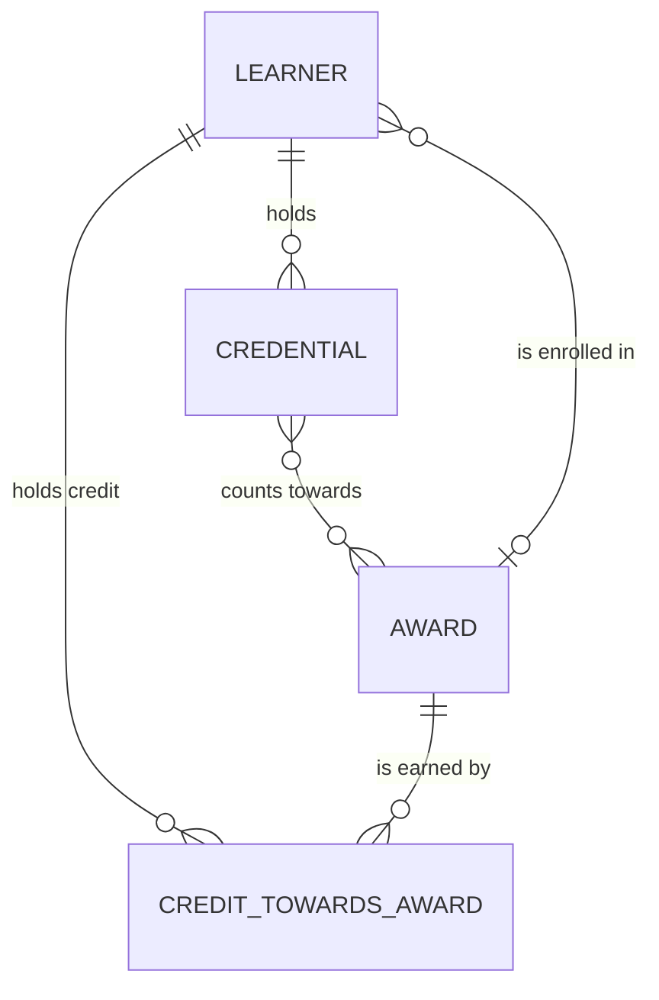

# In the weeds of data crafting · Written once: script

*The script of Written once, the ninth film of In the weeds of data crafting, a technical series for analytics engineers, as planned: about 4:45 (target 4 to 6 minutes), in eight chapters, in English, 30 September 2026. The narration lives in [`source/src/narration.js`](source/src/narration.js) and the pauses in [`source/src/breath.js`](source/src/breath.js); this page and those files say the same thing, and where they differ, the source wins. The timings are estimates from the word count (625 words, at the pace of the opening film, with the holds) until the voice is recorded; the pacing report replaces them. Takes steps 9 and 10 of Jun's ten, keeping each fact written once and letting the model change without breaking anyone, and closes the loop the opening film drew.*

## The promise

A practitioner follows every line, and a data architect agrees with it. Every copy of a fact is a chance for it to drift, so each fact gets one home. Meaning (what a thing is, its key, its owner) lives in the conceptual model, one per domain (`models/core/course/_course__conceptual.yml` for the award); decisions live in a log beside what they're about, because they hold *why*; the gaps the team accepted live on the model, as known limitations; everything the build uses (grain, keys, contracts, tests, owners) lives in dbt's YAML. Everything else is driven from those homes, in one direction: a script generates doc blocks from the conceptual model, dbt's YAML points to them with `doc()`, the physical diagram is generated from what dbt parsed, and on Databricks the build pushes descriptions to the catalog. CI fails when a generated file is out of date. The conceptual diagram is drawn by hand, because it shows meaning; the physical one is generated, because it shows structure. And written once doesn't mean frozen: a breaking change to a public model is a new version beside the old one, with a deprecation date, the consumers found through lineage and exposures, and dbt's warning for anyone still on the old one. **One home per fact. Everything else, generated.**

## The story in one paragraph

By the 1850s the note A sounded different from one city to the next, and kept creeping higher; in 1859 France fixed it by decree and kept one tuning fork in Paris as its home, other forks were checked against it, and instruments were tuned from those, never the other way round. Today an orchestra still tunes to one note before it plays. A definition can work the same way. Jun's pull request is merged, and the agent's review of the metadata has found the definition of an award in four places: the wiki, a YAML description, the catalog and the tooltip on Planning's census dashboard. Three have drifted (given "on paper"; no credit points; "a degree"); only the tooltip still says what Mei approved, the words in the conceptual model, and nothing kept the others in step. The fix isn't a fifth copy: the definition already has a home, and everything else has to be driven from it, one home per fact. Meaning goes in the conceptual model; decisions in a log beside what they're about; accepted gaps on the model, as known limitations; what the build uses in YAML. A script turns each definition into a doc block on a page nobody edits; the YAML names it; the agent's review finds no description written twice in the project, and the wiki now links to the docs site. The conceptual diagram stays hand-drawn; the physical one is generated from the manifest, and CI fails if it's stale. On Databricks, the build pushes descriptions to the catalog, and nobody edits them there. Then the model changes: a credential can expire, and `is_revoked` can't say so, so `core_credential` gets a version 2 with `status`; version 1 is built from version 2 until 31 March 2027; lineage finds one exposure to tell, the wallet app, which pins version 2; anyone still on version 1 gets dbt's warning with the date. The loop of ten steps closes, every station with a teal dot and a gold tick, and a new question arrives from the wallet team. Declare it. Then build it.

## What each object stands for

| Object | Stands for |
|---|---|
| "1850s"; three tuning forks from three cities, their sound drawn as three lines that don't line up, drifting upward | Copies of one thing, each kept by hand, drifting apart |
| "1859 · Paris"; a decree, "diapason normal"; one fork laid in a case | One home for one fact |
| Forks checked against it and stamped; a violinist tuning a string to one of them | Copies driven from the home, never the other way round |
| An orchestra today, every line settling onto the oboe's A | Everyone who relies on the one source |
| The fork's single line drifting into the present, becoming a definition card | A definition, kept in one place, everything else tuned from it |
| Four cards: a wiki page, a YAML description, a catalog entry, a dashboard tooltip; three turn amber, the drifted words underlined | Copies of one definition, drifting (drawn, labelled "as it drifts": not project files) |
| The teal orb, searching; four pins on the four cards | The agent's metadata review, with evidence (the hand-off from the film before) |
| Two columns, with a third home above them, the conceptual model: on the left, a decision log and a known limitation on the model; on the right, YAML | One home per fact |
| A thin arrow from `_course__conceptual.yml` through a cog (`scripts/generate/definitions.py`) to `_course__definitions.md`, then to `doc("award")` in YAML, then to the docs site | Written once, shown everywhere: one direction |
| A small cog on a file's corner | A generated file: nobody edits it |
| A red cross on a CI check, then green | A check that a generated file is current |
| A hand-drawn diagram (white on blue) beside a generated one (on glass, with a cog) | Draw the meaning; generate the structure |
| A catalog panel on the right, labelled "Databricks · Unity Catalog", with descriptions flowing in, and a hand's edit fading | One direction of sync |
| Two stacked cards, `core_credential` v2 (lit) and v1 (dimmer, with a date tag "31 Mar 2027") | A new version beside the old one, with a deprecation date |
| A lineage line from `core_credential` to one exposure badge, the wallet app | Who to tell |
| An amber warning line under an old consumer | dbt's deprecation warning |
| The loop of ten steps from the opening film, every station lit with a teal dot and a gold tick | The series, closed |
| A new question card landing at the first station | The loop begins again |

## Script

### 1 · One note · 0:00–0:38

**Narration.** By the 1850s, the note A sounded different from one city to the next, and it kept creeping higher. In 1859, France fixed it by decree, and kept one tuning fork in Paris as its home. Other forks were checked against it, and instruments were tuned from those, never the other way round. Today, before it plays, a whole orchestra still tunes to one note. A definition can work like that: kept in one place, and everything else tuned from it.

**Picture.** The warm past, with "1850s" in the corner. Three tuning forks stand on a table, each tagged with a city (generic tags: "one city", "another", "a third"); each one's sound is drawn as a line of light, and the three lines don't line up; over a few seconds, all three drift slowly upward (the drifting cue the next chapter uses again: a detuned felt pair, low, never a fork's bright ring). "1859 · Paris": a printed decree, "diapason normal", and one fork laid in a lined case (a low felt note). On "checked against it", a row of forks is held to it one by one, each line settling onto its line, and each gets a small stamp; on "tuned from those", a violinist's string settles onto one fork's line; an arrow from the fork to the violin, and none back. "Today": an orchestra in outline; the oboe's line sounds, and every other line settles onto it. On the bridge line, the fork's single line drifts right, towards the present, and becomes a card: "award · one definition". Wordless breather: the title card over the fork in its case, with the series' mark (on a felt piano): "IN THE WEEDS OF DATA CRAFTING", *Written once*, "one home per fact; everything else driven from it".

**On screen.** 1850s · the note A · a different pitch in every city · creeping higher · 1859 · Paris · fixed by decree · one fork · its home · checked against it · tuned from it · never the other way round · today · one note · kept in one place · everything else tuned from it · *Written once* · one home per fact; everything else driven from it

### 2 · Four copies · 0:38–1:14

**Narration.** The agent's review of the metadata found it: the definition of an award, in four places. The wiki, a YAML description, the catalog, and the tooltip on Planning's dashboard. One says an award is given on paper. One has lost its credit points. One calls every award a degree. Only the tooltip still says what Mei approved, the words in the conceptual model. Nothing kept the others in step. They drifted, one small edit at a time.

**Picture.** The films' dark glass, picking up where the film before left off: the teal orb's review card, "award · 4 places", then the orb pins four cards, each labelled as it's named (four copies drifting: a detuned felt pair, once). On "tooltip", Planning's census dashboard (the consumer badge) with the tooltip open over "award". Each card is drawn, not a project file, with a plain tag naming what it is (wiki, YAML description, catalog, tooltip) and a small tag, "as it drifts". The four copies:

- wiki: "A qualification the university confers **on paper**, such as a graduate certificate or a master, for a set number of credit points."
- YAML description: "A qualification the university confers, such as a graduate certificate or a master." (**credit points** missing, the gap underlined)
- catalog: "A **degree** the university confers, for a set number of credit points."
- tooltip: "A qualification the university confers, such as a graduate certificate or a master, for a set number of credit points. When it's conferred on a learner, it's a credential too." (the right words, still a copy)

On "the words in the conceptual model", the source the right copy matches draws in beside the tooltip, a project file, the course domain's conceptual model (its long path leaves no room for the label):

```yaml
# models/core/course/_course__conceptual.yml
  - name: award
    definition: >
      A qualification the university confers, such as a graduate certificate or a master, for
      a set number of credit points. When it's conferred on a learner, it's a credential too.
    owner: Mei Tanaka, registrar's office
```

On "drift", three cards turn amber, each drifted phrase underlined. On "only the tooltip", the fourth stays white; Mei's small gold tick sits on the conceptual model's card (her decision, 1 Oct), and a faint line joins the tooltip to it: same words, no wire. On "nothing kept the others in step", the three amber cards show no line to it at all. On "one small edit at a time", each amber card rewinds a few edits, faintly: each edit small, each one reasonable.

**On screen.** the agent's review · award · four places · wiki · YAML description · catalog · tooltip · as it drifts · on paper · no credit points · a degree · only the tooltip · what Mei approved · models/core/course/_course__conceptual.yml · nothing kept them in step · one small edit at a time

**In the repo.** [`models/core/course/_course__conceptual.yml`](https://github.com/roanboc/learning-data/blob/main/films/analytics-engineering/project/models/core/course/_course__conceptual.yml)

### 3 · What goes where · 1:14–1:56

**Narration.** The fix isn't a fifth copy, or a better one. The definition already has a home. Everything else has to be driven from it. Meaning lives in the conceptual model: what each thing is, its key, and who owns it. Decisions live in a log beside what they're about, with why and who. The gaps the team accepted live on the model, as known limitations. Everything the build uses lives in YAML: grain, keys, contracts, tests and owners. A decision log isn't a copy. It holds why, which a model's YAML has no place for.

**Picture.** The four cards slide aside; the conceptual model's card stays, lit: the home that already exists. Three homes draw in, each labelled as it's named: at the top, the conceptual model (white on blue, the blueprint's colour), `models/core/course/_course__conceptual.yml`; below it, two columns: on the left, what was decided and what was accepted, each beside what it's about; on the right, YAML. On "meaning", the award's lines light (definition, business key, owner). On "decisions", the project's decision log entry for this change types into the left column, tagged "a decision log · why · who":

```yaml
# models/_shared/_shared__decisions.yml · runs on dbt Core · DuckDB
  - id: DEC-PRJ-04
    title: Definitions are written once and generated
    …
    why: Four copies of a definition drift apart. One home, and one direction of sync, keeps them the same.
    decided_by: Jun Park and Noor
```

On "gaps", below it, a known limitation on the model it's about, tagged "accepted gaps · on the model":

```yaml
# models/core/student/_core_student__models.yml · runs on dbt Core · DuckDB
  - name: core_credential
    …
        limitations:
          - id: LIM-STU-06
            was: GAP-STU-02
            text: >
              No source records an expiry. status allows expired; nothing sets it yet.
```

On "the build uses", the YAML column fills with small tags: grain, keys, contracts, tests, owners; beside it, the conventions' rules:

```markdown
<!-- docs/conventions.md · runs on dbt Core · DuckDB -->
## Metadata

- `meta.grain`: on every core and mart model, the grain in one sentence ("One row per
  credential"). Each domain's physical diagram (`_<domain>__physical.md`) reads it; a test proves it.
- `meta.owner`: who owns the meaning (models) or the data (sources, seeds).
- `meta.domain`: the domain that owns the model, seed or source: `registrar` or `learning`
  (application domains: the teams whose systems are the sources), `student` or `course` (data
  domains), `planning` or `wallet` (business domains), or `shared`.
- `meta.glossary_term`: the term in the domain's conceptual model a model or key holds.
…
```

On "a decision log isn't a copy", the decision's `why:` lights gold-edged, and an empty space opens in the YAML column beside it, `why: ?`: a model's YAML has no place for why.

**On screen.** not a fifth copy · the home already exists · one home per fact · the conceptual model · meaning · what it is · its key · its owner · a decision log · why · who · accepted gaps · on the model · YAML · grain · keys · contracts · tests · owners · a decision log holds why · a model's YAML has no place for why

**In the repo.** [`models/core/course/_course__conceptual.yml`](https://github.com/roanboc/learning-data/blob/main/films/analytics-engineering/project/models/core/course/_course__conceptual.yml) · [`models/_shared/_shared__decisions.yml`](https://github.com/roanboc/learning-data/blob/main/films/analytics-engineering/project/models/_shared/_shared__decisions.yml) · [`models/core/student/_core_student__models.yml`](https://github.com/roanboc/learning-data/blob/main/films/analytics-engineering/project/models/core/student/_core_student__models.yml) · [`docs/conventions.md`](https://github.com/roanboc/learning-data/blob/main/films/analytics-engineering/project/docs/conventions.md)

### 4 · Written once, shown everywhere · 1:56–2:37

**Narration.** So the award is defined once, in the conceptual model. A script turns each definition into a doc block, on a Markdown page it writes itself. Nobody edits that page. The YAML doesn't copy the definition. It names it, and dbt shows the definition there. To change the meaning, change one line, with Mei's approval. Edit the generated page instead, and the check in CI fails. The agent's review runs again: in the project, no description written twice. The wiki now links to the docs site.

**Picture.** A chain draws left to right, each link a card, lighting as it's named. First, the conceptual model's header:

```yaml
# models/core/course/_course__conceptual.yml · runs on dbt Core · DuckDB
# The course domain's conceptual model: the awards the university offers. Owned by the registrar's
# office.
#
# Not parsed by dbt (.dbtignore). scripts/generate/definitions.py turns each definition into a
# doc block in _course__definitions.md, next to this file, which the dbt YAML shows with doc() and
# Databricks pushes to Unity Catalog. The diagram is drawn by hand in _course__conceptual.md.
```

Then the script (a cog turns; a generated file writing: muffled keys):

```python
# scripts/generate/definitions.py · runs on dbt Core · DuckDB
"""Writes each domain's definitions, the university's map and the key sets seed from the conceptual model.

The meaning is written once, in the conceptual model:
- one file per core domain and per mart, next to its models
  (models/core/<domain>/_<domain>__conceptual.yml, models/marts/<consumer>/_<consumer>__conceptual.yml).
  This script turns its entities and relationships into doc blocks in _<domain>__definitions.md,
  next to it; the dbt YAML shows them with doc(), and on Databricks persist_docs pushes them to
  Unity Catalog.
…
    python scripts/generate/definitions.py           # write the definitions and the key sets seed
    python scripts/generate/definitions.py --check   # fail if any is out of date
"""
```

Then the generated page, with a small cog on its corner:

```markdown
<!-- models/core/course/_course__definitions.md · runs on dbt Core · DuckDB -->
# Course domain: definitions

*Generated by `scripts/generate/definitions.py` from `_course__conceptual.yml`, next to this file.
Edit the conceptual model, then run the script; don't edit this file.*


**Award.** A qualification the university confers, such as a graduate certificate or a master,
for a set number of credit points. When it's conferred on a learner, it's a credential too.

- Business key: The award code, qualified by its key set, SIS|GCDA. Issued by: Registrar's office.
- Owner of the meaning: Mei Tanaka, registrar's office.
- History: Every version, dated when it was recorded.

```

Then the YAML that points to it, `doc("award")` lit:

```yaml
# models/core/course/_core_course__models.yml · runs on dbt Core · DuckDB
  - name: core_award
    description: >
      An award the university offers, as it stood from valid_from until valid_to.
      {{ doc("award") }}
```

and the docs site's page for `core_award`, the definition shown in full. On "one line", the definition's line in `_course__conceptual.yml` lights, and Mei's gold tick lands beside it. On "edit the generated page", a hand types "on paper" into `_course__definitions.md`; a CI check draws red (a muted double knock) with its real message, on two lines, `models/core/course/_course__definitions.md is out of date: run python scripts/generate/definitions.py`; the edit fades, and the check turns green: `the definitions, the map and seeds/reference/shared/key_sets.csv are up to date`. On "runs again", the teal orb's result card:

```
$ python skills/review-metadata/find_repeats.py
0 description(s) written more than once
```

On "the wiki now links", the amber wiki card from the chapter before returns: its definition is struck through and replaced by a single link, "award → the docs site", and the card turns white. (The agent's check covers the project only; the wiki is fixed by a person, the change drawn, not run.)

**On screen.** defined once · _course__conceptual.yml · scripts/generate/definitions.py · doc blocks · _course__definitions.md · generated · don't edit this file · doc("award") · named, not copied · one line · Mei's approval · the check fails · in the project: 0 descriptions written twice · the wiki links to the docs site

**In the repo.** [`models/core/course/_course__conceptual.yml`](https://github.com/roanboc/learning-data/blob/main/films/analytics-engineering/project/models/core/course/_course__conceptual.yml) · [`scripts/generate/definitions.py`](https://github.com/roanboc/learning-data/blob/main/films/analytics-engineering/project/scripts/generate/definitions.py) · [`models/core/course/_course__definitions.md`](https://github.com/roanboc/learning-data/blob/main/films/analytics-engineering/project/models/core/course/_course__definitions.md) · [`models/core/course/_core_course__models.yml`](https://github.com/roanboc/learning-data/blob/main/films/analytics-engineering/project/models/core/course/_core_course__models.yml)

### 5 · Diagrams that can't drift · 2:37–3:07

**Narration.** Diagrams drift too. The conceptual diagram is drawn by hand, for people. It changes only when the meaning does. The physical diagram is generated: every core and mart table, its columns, types and keys, read from what dbt parsed. If the YAML changes and the diagram doesn't, CI fails. Draw the meaning. Generate the structure.

**Picture.** A diagram on an old wiki page, dated last year, fades amber. Two diagrams draw side by side. Left, white on blue, the hand-drawn one:

~~~~markdown
<!-- models/core/student/_student__conceptual.md · runs on dbt Core · DuckDB -->

~~~~

rendered as it types (five entities' boxes, five lines). Right, on glass with a cog, the generated one:

```markdown
<!-- models/core/student/_student__physical.md · runs on dbt Core · DuckDB -->
# Student domain: physical model

*Generated by `scripts/generate/diagrams.py` from `target/manifest.json`. Don't edit this file:
change the YAML, run `dbt parse`, then run the script. CI fails if it's out of date.*
…
    core_credential_v2 {
        string credential_key PK
        string credential_bk
        string learner_key FK
        …
```

rendered as tables with columns and types. On "if the YAML changes", a column's type changes in `_core_student__models.yml`; the right-hand diagram goes amber and the CI step draws red, `models/core/student/_student__physical.md is out of date: run dbt parse, then python scripts/generate/diagrams.py`; the script runs, the diagram updates, and the step goes green. The two CI steps from the workflow (repository root):

```yaml
# .github/workflows/credential-project.yml · runs on dbt Core · DuckDB
      - name: Doc blocks and key sets match the conceptual model
        run: python scripts/generate/definitions.py --check

      - name: Physical diagram matches the YAML
        run: python scripts/generate/diagrams.py --check
```

and their real output: `the definitions, the map and seeds/reference/shared/key_sets.csv are up to date` · `the physical models are up to date`. On "Draw the meaning. Generate the structure.", the two diagrams settle side by side, each with its label.

**On screen.** diagrams drift too · conceptual · drawn by hand · for people · physical · generated · every table · columns · types · keys · from what dbt parsed · _core_student__models.yml: data_type changed · CI fails if it's out of date · draw the meaning · generate the structure

**In the repo.** [`models/core/student/_student__conceptual.md`](https://github.com/roanboc/learning-data/blob/main/films/analytics-engineering/project/models/core/student/_student__conceptual.md) · [`models/core/student/_student__physical.md`](https://github.com/roanboc/learning-data/blob/main/films/analytics-engineering/project/models/core/student/_student__physical.md)

### 6 · One direction · 3:07–3:37

**Narration.** On Databricks, people find tables in the catalog, and read their descriptions there. So each build pushes the descriptions out to it, for each table and its columns. Nobody edits them there: a rebuild writes over the edit. Fix it at home, and it flows out. One direction: from the files, out to the catalog and whatever reads it. Tuned from one source, never the other way round.

**Picture.** A catalog panel on the right, labelled "Databricks · Unity Catalog" (the story's stack, in the dim label the series uses for it): `core_award_v1` (the table dbt builds for the versioned model, in the default `dev_core` schema), its description and its columns' comments. The setting lights:

```yaml
# dbt_project.yml · runs on dbt Core · DuckDB
models:
  credentials:
    # Databricks only: push descriptions to Unity Catalog. DuckDB leaves them in the docs site.
    +persist_docs:
      relation: "{{ target.type == 'databricks' }}"
      columns: "{{ target.type == 'databricks' }}"
```

On "pushes", descriptions flow along one arrow from the files into the catalog panel, table then columns. On "nobody edits them there", a hand types a change into the catalog's description; on "write over", a build runs and the text returns to the definition. On "at home", the change is made in `_course__conceptual.yml` instead, and it flows through the homes, `_course__conceptual.yml` → `_course__definitions.md` → `_core_course__models.yml`, and out to the catalog. On "whatever reads it", the dashboard's tooltip, now drawn reading from the catalog rather than holding a copy. On "tuned from one source", a brief echo of the past: the fork in its case, an arrow out to a violin and none back, then the catalog again.

**On screen.** Databricks · Unity Catalog · descriptions · persist_docs · each table · its columns · nobody edits them there · a rebuild writes over it · fix it at home · one direction · tuned from one source, never the other way round

**In the repo.** [`dbt_project.yml`](https://github.com/roanboc/learning-data/blob/main/films/analytics-engineering/project/dbt_project.yml)

### 7 · The next version · 3:37–4:32

**Narration.** Written once doesn't mean never changed. A credential can expire, and a true or false can't say so. So `is_revoked` becomes status: valid, expired or revoked. That breaks anyone who reads the old column. So it's a new version of the credential, beside the old one. Version one is built from version two, so the logic lives once. And it has a date to go: the 31st of March, 2027. The exposures declared with the contracts say who to tell: only the wallet app. It pins version two. Anyone still reading version one gets dbt's warning, with the date, every time they build. A breaking change arrives as a choice with a deadline, not as a surprise.

**Picture.** `core_credential` as its product card from *Who owns what*. On "expire", a column `is_revoked` (true, false) and beside it `status` with three values, `expired` lit as the one a true-or-false can't hold. On "breaks", a line from the old column to a consumer strains. The card splits into two stacked cards, v2 in front (the version stamp: a low stamp), v1 behind. The versions:

```yaml
# models/core/student/_core_student__models.yml · runs on dbt Core · DuckDB
    versions:
      - v: 2
        …
      - v: 1
        deprecation_date: 2027-03-31
        description: >
          Version 1: a credential issued to a learner, with is_revoked in place of status.
          Deprecated: status replaces is_revoked in version 2, because a credential can also
          expire. Built from version 2 until 31 March 2027. Temporary: removed after its
          deprecation date, once its consumers have moved to version 2.
        …
        columns:
          - include: all
            exclude: [learner_bk, status, revoked_on, loaded_at]
          - name: is_revoked
```

On "built from version two", an arrow from v2 to v1:

```sql
-- models/core/student/core_credential_v1.sql · runs on dbt Core · DuckDB
-- Version 1, built from version 2 until its deprecation date: the logic lives once.
with

credentials as (

    select * from {{ ref('core_credential', v=2) }}
…
    status = 'revoked' as is_revoked
```

On the date, a tag "31 Mar 2027" hangs on v1. On "lineage", the lineage graph lights from `core_credential` rightwards to the wallet's two marts, and on to one exposure badge; Planning's dashboard stays dark (it doesn't read the credential):

```
$ dbt ls --select core_credential+ --resource-type exposure
exposure:credentials.wallet_app
```

On "pins", the wallet's mart:

```sql
-- models/marts/wallet/mart_wallet__credentials.sql · runs on dbt Core · DuckDB
credentials as (

    select * from {{ ref('core_credential', v=2) }}

),
```

The wallet team, told, gives its gold tick. On "warning", a small model still reading version 1 draws, and dbt's real warning types beneath it, amber (trimmed):

```
[WARNING]: While compiling 'mart_wallet__old_reader': Found a reference to
core_credential.v1, which is slated for deprecation on '2027-03-31T00:00:00+00:00'.
A new version of 'core_credential' is available. Try it out:
{{ ref('credentials', 'core_credential', v='2') }}.
```

On "a choice with a deadline", the decision, in the student domain's log, with Noor's and Mei's gold ticks:

```yaml
# models/core/student/_student__decisions.yml · runs on dbt Core · DuckDB
  - id: DEC-STU-07
    title: core_credential version 2 replaces is_revoked with status
    …
    decided_by: Noor and Mei Tanaka
    informed: [Wallet app team]
```

**On screen.** written once ≠ never changed · is_revoked · status · valid · expired · revoked · breaks the old column · a new version · v2 · v1 · built from v2 · the logic lives once · deprecation 31 Mar 2027 · lineage · one exposure · wallet_app · pins v2 · dbt's warning · a choice with a deadline · not a surprise

**In the repo.** [`models/core/student/_core_student__models.yml`](https://github.com/roanboc/learning-data/blob/main/films/analytics-engineering/project/models/core/student/_core_student__models.yml) · [`models/core/student/core_credential_v1.sql`](https://github.com/roanboc/learning-data/blob/main/films/analytics-engineering/project/models/core/student/core_credential_v1.sql) · [`models/marts/wallet/mart_wallet__credentials.sql`](https://github.com/roanboc/learning-data/blob/main/films/analytics-engineering/project/models/marts/wallet/mart_wallet__credentials.sql) · [`models/core/student/_student__decisions.yml`](https://github.com/roanboc/learning-data/blob/main/films/analytics-engineering/project/models/core/student/_student__decisions.yml)

### 8 · The loop closes · 4:32–5:03

**Narration.** That's the loop. A question, the sources, the consumers, gaps and contracts, tests, layers, the trusted number, review, written once, and change. At every step, the agent drafted and checked. At every step, a person approved. And a new question arrives, from the wallet team. The loop starts again, at the question. Declare it. Then build it.

**Picture.** The loop of ten stations from the opening film, drawn as it was, lighting one by one as the steps are named, each with its glyph; at each, a teal dot and a gold tick, already there from the films before. Along the loop, once, the people of the series, each at the station where they approved: Planning at the question, Mei at the sources and the meaning, the learning team at the warn-and-stop, Noor at the model and the versions, the wallet team at its contract, Jun at review. On "a new question", a card lands at the first station, with the wallet's consumer badge; the first station lights again, and the teal orb moves towards it. On "Declare it. Then build it.", the credential blueprint (white on blue) settles over the lineage graph, as it did at the end of the opening film. Wordless end card: *Written once* · "One home per fact. Everything else, generated." · In the weeds of data crafting. The mark plays on the felt piano, then is answered by the opening film's electric piano, and resolves on D major.

**On screen.** a question · the sources · the consumers · gaps and contracts · tests · layers · the trusted number · review · written once · change · the agent drafts and checks · a person approves · a new question · the wallet team · Declare it. Then build it. · *Written once* · One home per fact. Everything else, generated.

## Pause and think

Four stops, one question each.

| After | Question | Answer, in short |
|---|---|---|
| 2 · Four copies (`four`) | The tooltip is right. Why isn't it the fix? | It's right by luck: it's a copy whose words happen to match the home, the definition Mei approved in `_course__conceptual.yml`, and nothing keeps it so. Fixing the three wrong copies by hand only makes four copies again; each has to be driven from the home. |
| 3 · What goes where (`where`) | Is a decision log duplication? | No. A model's YAML says what is true now; the log says why, when and who decided. A model's YAML has no place for why, and without the log the next person reopens the decision. |
| 5 · Diagrams that can't drift (`diagrams`) | Why draw one diagram by hand and generate the other? | The conceptual diagram shows meaning, which only people decide, and changes rarely; drawn by hand, it can say what matters and leave out the rest. The physical diagram shows structure, every table, column and key, which changes with every YAML edit; drawn by hand, it would be out of date within a week. |
| 7 · The next version (`version`) | When is a change breaking? | When a consumer that reads the model as it is would get an error or a different meaning: a column removed or renamed, a type changed, a grain changed, a value's meaning changed. Adding a column usually isn't. A breaking change to a public model is a new version, with a deprecation date and the exposures told. |

## Rigour sheet

| Chapter | What the film says | What an expert would add, or what it simplifies |
|---|---|---|
| 1 | By the 1850s, the note A sounded different from one city to the next, and it kept creeping higher. | Concert pitch varied widely across Europe in the 18th and 19th centuries, and rose in the first half of the 19th (orchestras tuned higher for brilliance; singers complained). Figures for particular cities are left out of the narration and the picture (generic city tags), because published values vary by source and instrument. To check on the day: Ellis (1880); Haynes (2002). |
| 1 | In 1859, France fixed it by decree, and kept one tuning fork in Paris as its home. | The ministerial arrêté of 16 February 1859, on the report of a commission (musicians and physicists), fixed the *diapason normal* at 870 simple vibrations a second, A = 435 Hz in today's terms, and a standard fork was deposited at the Paris Conservatoire. "Decree" is the usual English word for the arrêté. To check on the day: the decree's text, and the fork's maker and keeping. |
| 1 | Other forks were checked against it, and instruments were tuned from those, never the other way round. | The decree required the theatres and music schools it covered to use the standard pitch, with forks verified against the standard (the picture draws a stamp for that verification; to check the decree's exact wording on the day). "Never the other way round" is the direction the picture draws: copies come from the standard, and the standard is not adjusted to them. The standard itself was later replaced: an international conference in London in 1939 agreed A = 440 Hz, and ISO 16 (1955, revised 1975) records it; many orchestras tune slightly higher today. |
| 1 | Today, before it plays, a whole orchestra still tunes to one note. | Orchestras tune to an A, usually given by the oboe (or a keyboard instrument when one plays). A practice, not a law. |
| 1 | A definition can work like that. | The series' metaphor: one home, copies driven from it, one direction. The picture's "detuned pair" for drifting copies is the film's sound cue, kept low and soft as the series requires; a real fork's ring is high, and is not used. |
| 2 | The definition of an award in four places; three drifted; only the tooltip still says what Mei approved, the words in the conceptual model. | The four copies are drawn, not project files: the wiki page, the tooltip and the drifted YAML and catalog texts don't exist in the project, which holds only the one definition (`models/core/course/_course__conceptual.yml` 18-26). Each is tagged with what it is and "as it drifts"; none carries the `runs on dbt Core · DuckDB` label. The home existed before this film: the conceptual model's scope dates from 1 Oct (DEC-PLN-01, `models/marts/planning/_planning__decisions.yml` 10-18) and the course domain's conceptual model holds Mei's definition; what was missing is anything driving the copies from it. |
| 2 | The agent's review of the metadata found it. | The hand-off from the film before, whose last chapter ends: "Then the agent reviews the metadata, in the project and beyond it, and finds something no test checks. The definition of an award now lives in four places. And three of them are wrong." This film opens on that finding, not a second discovery. `skills/review-metadata/SKILL.md` covers the project's YAML and Markdown: generated files current (step 1), descriptions written word for word more than once (step 2, `find_repeats.py`), definitions outside the conceptual model (step 3). The wiki and the dashboard are outside the project; in the story the agent's review reads them too. `find_repeats.py` finds only exact repeats; near-repeats, the drift, are for step 3's reading (the skill says so). |
| 3 | Meaning lives in the conceptual model; decisions in a log beside what they're about; the gaps the team accepted on the model, as known limitations; what the build uses in YAML. | `models/core/course/_course__conceptual.yml` 1-6 (header), 18-26 (award); `models/_shared/_shared__decisions.yml` 43-51 (DEC-PRJ-04); `models/core/student/_core_student__models.yml` 111, 123, 137-140 (LIM-STU-06); `docs/conventions.md` 222-228 (*Metadata*), 58 (decision logs) and *File lifecycles*. Each core domain and mart has its own conceptual model, next to its models; the university's map of domains is `models/_shared/_shared__conceptual.yml`. The conceptual model is YAML, not Markdown: meaning is written as data so a script can generate from it; the hand-drawn diagram and its reading are Markdown beside it (`_<domain>__conceptual.md`). A decision log is YAML too, but not dbt's: `.dbtignore` keeps it out of the parse. There is one log per scope (the project's in `models/_shared/`, and one beside each source, core domain and mart); `scripts/generate/decisions.py` checks them and writes `docs/decisions.md`, a generated index, not where a decision is written. A known limitation is permanent, on the model or source table it's about (`meta.limitations`, with `was:` naming the gap it came from); a gap still open lives in `requirements/` only while it's open (`requirements/README.md`). |
| 3 | The definition already has a home; a decision log isn't a copy: it holds why, which a model's YAML has no place for. | Each decision in a log has an id, a title, the text, why, who decided, when, and a status (the schema is in `requirements/README.md`, *A decision*); a decision is never deleted, only superseded. dbt's YAML has no field for rationale; a model's `meta` could hold it, but then a decision about several models would be copied into each, a second home. |
| 4 | A script turns each definition into a doc block, on a page it writes itself. | `scripts/generate/definitions.py` 1-22: one definitions page per core domain and mart, next to its conceptual model; it also draws the university's map (`models/_shared/_shared__conceptual.md`) and generates `seeds/reference/shared/key_sets.csv` from the key set written on each source (`meta.key_set`). Doc blocks are dbt's `…` in any `.md` file under `docs-paths` (`dbt_project.yml` 14: `sources` and `models`), shown with `{{ doc("name") }}` in a description. |
| 4 | The YAML doesn't copy the definition; it names it, and dbt shows the definition there. | `models/core/course/_core_course__models.yml` 3-6. dbt resolves `doc()` at parse; the resolved text is what the docs site shows and what `persist_docs` pushes. |
| 4 | Edit the generated page, and the check in CI fails. | Run 6 October 2026 on a scratch copy (first run 30 September, before the project was organised by domain): after typing "on paper" into the award's definition in `models/core/course/_course__definitions.md`, `python scripts/generate/definitions.py --check` printed "models/core/course/_course__definitions.md is out of date: run python scripts/generate/definitions.py" and exited 1; with the file restored, "the definitions, the map and seeds/reference/shared/key_sets.csv are up to date". The check compares each generated file with what the script would write, so an edit to the conceptual model that isn't regenerated fails it too. CI runs it: `.github/workflows/credential-project.yml` 46-47 (repository root). |
| 4 | The agent's review runs again: in the project, no description written twice. | `python skills/review-metadata/find_repeats.py` on the project, 30 September 2026 and again 6 October 2026: "0 description(s) written more than once". It scans only the project's YAML and skips descriptions that use `doc()`, so it says nothing about the wiki; the narration says "in the project" for that reason. |
| 4 | The wiki now links to the docs site. | Story, drawn: the wiki is outside the project. A person replaces the wiki's definition with a link to the award's page on dbt's docs site (`dbt docs generate`), as Scenario 2 recommends for the diagram. No check guards the wiki; a link can't drift the way a copy can. |
| 5 | The conceptual diagram is drawn by hand; the physical one is generated from what dbt parsed. | `models/core/student/_student__conceptual.md` 8-15 (Mermaid `erDiagram`, drawn by hand; each core domain and mart has its own); `models/core/student/_student__physical.md` 1-3 and the diagram from line 7, generated by `scripts/generate/diagrams.py` from `target/manifest.json`, one page per domain (that domain's core or mart models at their latest versions: columns with contracted types, PK from primary-key constraints, FK from relationships tests). Mermaid renders on GitHub; whether dbt's docs site renders Mermaid in a doc block is to check on the day, so the film shows the diagrams as rendered pages, not as the dbt docs site. |
| 5 | If the YAML changes and the diagram doesn't, CI fails. | `.github/workflows/credential-project.yml` 49-50: `python scripts/generate/diagrams.py --check`, after `dbt build` (which writes the manifest). Both checks passed on 6 October 2026 (as on 30 September): "the definitions, the map and seeds/reference/shared/key_sets.csv are up to date", "the physical models are up to date". On a scratch copy, after changing columns' `data_type` in `_core_student__models.yml` and running `dbt parse`, the diagram check printed "models/core/student/_student__physical.md is out of date: run dbt parse, then python scripts/generate/diagrams.py" and exited 1. |
| 6 | On Databricks, each build pushes the descriptions to the catalog, for each table and its columns. | dbt's `persist_docs` config, `relation` and `columns`: dbt-databricks writes them as table and column comments, which Unity Catalog shows. `dbt_project.yml` 25-30 turns it on for Databricks only, project-wide, so the staging and intermediate views take it too; on DuckDB the descriptions stay in dbt's docs site. Checked 1 October 2026 in the dbt-databricks source (github.com/databricks/dbt-databricks, `main`, `macros/relations/view/create.sql`): a view's comment and its columns' comments are written in its `create or replace view` statement. Older adapter versions differed for column comments on views; the narration says "each table and its columns" and doesn't claim every view. |
| 6 | A rebuild writes over an edit made in the catalog. | For models rebuilt as tables (`create or replace`), the comments are set again from the YAML on every build. For `core_credential` v2, incremental: checked 1 October 2026 in the dbt-databricks source (`macros/materializations/incremental/incremental.sql`, `main`), the merge path ends with `persist_docs(target_relation, model, for_relation=True)`, so incremental runs re-apply the comments. For views under the adapter's newer materialization flag (`use_materialization_v2`), an unchanged view can be a no-op, so "a rebuild" rather than "every build". To confirm against the adapter version the story's stack runs. |
| 6 | Whatever reads the catalog. | The dashboard's tooltip reading from the catalog is drawn as the fix, not a feature of the project; Databricks tools that read Unity Catalog comments (Catalog Explorer, and assistants that use table metadata) show them. |
| 7 | A credential can expire; a true or false can't say so; `is_revoked` becomes `status`. | DEC-STU-07, `models/core/student/_student__decisions.yml` 78-90 (13 Oct). `status` accepts `valid`, `expired`, `revoked` (`_core_student__models.yml` 198-204); no source records an expiry yet, so nothing sets `expired` (LIM-STU-06 on `core_credential`, `_core_student__models.yml` 137-140, was GAP-STU-02). Built 30 September 2026: v2 holds 53 credentials, 52 valid and 1 revoked (Jordan's microcredential `LMS|B-5028`, revoked 12 Aug 2026); v1 holds the same 53, 1 with `is_revoked` true. |
| 7 | That breaks anyone who reads the old column; so it's a new version, beside the old one. | dbt model versions: `versions:` with `v:`, `latest_version`, and per-version columns (`include`/`exclude`). `models/core/student/_core_student__models.yml` 116 (`latest_version: 2`), 211-236. Each version is its own table (`core_credential_v1`, `core_credential_v2`). An unpinned `ref('core_credential')` resolves to the latest version. |
| 7 | Version one is built from version two, so the logic lives once. | `models/core/student/core_credential_v1.sql` 1-6, 20. A project choice, not a dbt rule: each version can have its own SQL. |
| 7 | It has a date to go: 31 March 2027. | `deprecation_date: 2027-03-31` (`_core_student__models.yml` 221). dbt doesn't drop the model on that date; it warns. After the date the owner removes the version: version 1 is temporary, as its description now says, and *File lifecycles* in `docs/conventions.md` lists it with the files deleted when their work is done. |
| 7 | The exposures declared with the contracts say who to tell: only the wallet app. | The exposures were declared in the film that wrote the contracts, which also showed this lineage query; here it's used, not explained again. `dbt ls --select core_credential+ --resource-type exposure` on 30 September 2026, and again on 6 October 2026: `exposure:credentials.wallet_app`. Planning's `census_dashboard` reads credit, not credentials, so it isn't downstream. The exposure names its owner (`exposures/wallet/_wallet__exposures.yml` 3-15). |
| 7 | The wallet pins version two. | `models/marts/wallet/mart_wallet__credentials.sql` 3-7; `mart_wallet__learners.sql` 23 too. |
| 7 | Anyone still reading version one gets dbt's warning, with the date, every time they build. | Run 30 September 2026 on a scratch copy with `models/marts/wallet/mart_wallet__old_reader.sql` holding `select * from {{ ref('core_credential', v=1) }}`: `dbt parse` warned "While compiling 'mart_wallet__old_reader': Found a reference to core_credential.v1, which is slated for deprecation on '2027-03-31T00:00:00+00:00'. A new version of 'core_credential' is available. Try it out: {{ ref('credentials', 'core_credential', v='2') }}." (dbt's `UpcomingReferenceDeprecation`; after the date it becomes `DeprecatedReference`.) Repeated 6 October 2026 on the project organised by domain: the same warning. The warning is raised whenever the referring model is parsed or compiled; "every time they build" simplifies that. Not committed. |
| 8 | The loop of ten steps; at every step the agent drafted and checked, and a person approved. | The loop from the opening film; "the trusted number" is step 7, Validate ("Validate against a number people trust" in the opening film; reconcile with the trusted number, in the proposal); `docs/process.md` and `AGENTS.md` 71-80 ("The agent recommends; people approve."). |
| 8 | A new question arrives, from the wallet team. | Illustrative: no second question is in the project. |

**Project files each snippet comes from** (checked against the files on 6 October 2026):

| Ch | File | Lines |
|---|---|---|
| 2 | [`models/core/course/_course__conceptual.yml`](https://github.com/roanboc/learning-data/blob/main/films/analytics-engineering/project/models/core/course/_course__conceptual.yml) | 18-22, the source the tooltip matches (the four copies, the tooltip among them, are drawn, not files) |
| 3 | [`models/core/course/_course__conceptual.yml`](https://github.com/roanboc/learning-data/blob/main/films/analytics-engineering/project/models/core/course/_course__conceptual.yml) | 18-26, the award on the blueprint |
| 3 | [`models/_shared/_shared__decisions.yml`](https://github.com/roanboc/learning-data/blob/main/films/analytics-engineering/project/models/_shared/_shared__decisions.yml) | 43, 45, 48-49 (trimmed with …) |
| 3 | [`models/core/student/_core_student__models.yml`](https://github.com/roanboc/learning-data/blob/main/films/analytics-engineering/project/models/core/student/_core_student__models.yml) | 111, 123, 137-140 (trimmed with …) |
| 3 | [`docs/conventions.md`](https://github.com/roanboc/learning-data/blob/main/films/analytics-engineering/project/docs/conventions.md) | 222-227 (trimmed with …; lines wrapped) |
| 4 | [`models/core/course/_course__conceptual.yml`](https://github.com/roanboc/learning-data/blob/main/films/analytics-engineering/project/models/core/course/_course__conceptual.yml) | 1-6 |
| 4 | [`scripts/generate/definitions.py`](https://github.com/roanboc/learning-data/blob/main/films/analytics-engineering/project/scripts/generate/definitions.py) | 1-8, 20-22 (trimmed with …) |
| 4 | [`models/core/course/_course__definitions.md`](https://github.com/roanboc/learning-data/blob/main/films/analytics-engineering/project/models/core/course/_course__definitions.md) | 1-11 (lines 3 and 6 wrapped) |
| 4 | [`models/core/course/_core_course__models.yml`](https://github.com/roanboc/learning-data/blob/main/films/analytics-engineering/project/models/core/course/_core_course__models.yml) | 3-6 |
| 4 | [`skills/review-metadata/find_repeats.py`](https://github.com/roanboc/learning-data/blob/main/films/analytics-engineering/project/skills/review-metadata/find_repeats.py) | its output |
| 4 | [`scripts/generate/definitions.py`](https://github.com/roanboc/learning-data/blob/main/films/analytics-engineering/project/scripts/generate/definitions.py) | `--check`: its message (scratch copy) |
| 5 | [`models/core/student/_student__conceptual.md`](https://github.com/roanboc/learning-data/blob/main/films/analytics-engineering/project/models/core/student/_student__conceptual.md) | 8-15 |
| 5 | [`models/core/student/_student__physical.md`](https://github.com/roanboc/learning-data/blob/main/films/analytics-engineering/project/models/core/student/_student__physical.md) | 1-3, 9-12 (line 3 wrapped; the Mermaid fence left out; trimmed with …) |
| 5 | `.github/workflows/credential-project.yml` (repository root) | 46-50 |
| 6 | [`dbt_project.yml`](https://github.com/roanboc/learning-data/blob/main/films/analytics-engineering/project/dbt_project.yml) | 25-30 |
| 7 | [`models/core/student/_core_student__models.yml`](https://github.com/roanboc/learning-data/blob/main/films/analytics-engineering/project/models/core/student/_core_student__models.yml) | 213-214, 220-226, 232-235 (trimmed with …) |
| 7 | [`models/core/student/core_credential_v1.sql`](https://github.com/roanboc/learning-data/blob/main/films/analytics-engineering/project/models/core/student/core_credential_v1.sql) | 1-6, 20 |
| 7 | [`models/marts/wallet/mart_wallet__credentials.sql`](https://github.com/roanboc/learning-data/blob/main/films/analytics-engineering/project/models/marts/wallet/mart_wallet__credentials.sql) | 3-7 |
| 7 | `dbt ls` | its output |
| 7 | dbt's warning (scratch copy) | wrapped to fit |
| 7 | [`models/core/student/_student__decisions.yml`](https://github.com/roanboc/learning-data/blob/main/films/analytics-engineering/project/models/core/student/_student__decisions.yml) | 78, 80, 85, 88 (trimmed with …) |

**The run.** `dbt build --profiles-dir . --vars '{as_is_date: 2026-09-30}'` on 30 September 2026, dbt Core 1.12.5 with dbt-duckdb 1.11.0: PASS 143, WARN 1 (by design, gap 5), ERROR 0, 146 nodes. Run again on 6 October 2026, on the project organised by domain, with the same versions: PASS 144, WARN 1 (by design: an enrolment with no email, LIM-SC-02 and DEC-SC-01 on the `short_courses` source), ERROR 0, 147 nodes. Every card carries the label `runs on dbt Core · DuckDB`; the catalog panel is labelled `Databricks · Unity Catalog`, the story's stack, where `persist_docs` is on.

**dbt and Databricks documentation** (the pages behind each claim; on 30 September 2026 docs.getdbt.com couldn't be reached from the build machine, so each claim was checked against the project's own runs and a web search; to confirm on the pages on the day):

- dbt: "Documentation" and doc blocks (docs.getdbt.com/docs/build/documentation), `doc()` (docs.getdbt.com/reference/dbt-jinja-functions/doc), `docs-paths` (docs.getdbt.com/reference/project-configs/docs-paths); `persist_docs` (docs.getdbt.com/reference/resource-configs/persist_docs); "Model versions" (docs.getdbt.com/docs/mesh/govern/model-versions) and `deprecation_date` (docs.getdbt.com/reference/resource-properties/deprecation_date), including the warning text; `latest_version` and `versions` (docs.getdbt.com/reference/resource-properties/versions); exposures (docs.getdbt.com/docs/build/exposures); node selection with `+` (docs.getdbt.com/reference/node-selection/graph-operators); "Coordinating model versions" (docs.getdbt.com/best-practices/how-we-mesh/mesh-6-coordinate-versions).
- Databricks: "Add comments to data and AI assets" (docs.databricks.com/aws/en/comments/) and `COMMENT ON` (docs.databricks.com/aws/en/sql/language-manual/sql-ref-syntax-ddl-comment); the dbt-databricks adapter's documentation persistence (github.com/databricks/dbt-databricks).

**Historical sources.**

- Alexander J. Ellis, "On the history of musical pitch", *Journal of the Society of Arts*, 1880: pitch across Europe before and after 1859.
- Bruce Haynes, *A History of Performing Pitch: The Story of "A"*, Scarecrow Press, 2002: the rise of pitch, the French commission and the *diapason normal*.
- The arrêté of 16 February 1859 and the commission's report (Paris, 1859), as reprinted or summarised in the sources above: 870 simple vibrations; the standard fork at the Conservatoire.
- ISO 16, *Acoustics: Standard tuning frequency (Standard musical pitch)*, 1975 (first edition 1955): A = 440 Hz.
- Not yet checked against the primary texts (written 1 October 2026, from published accounts); to confirm on the day before the picture is drawn.

## Labs

| # | Lab | Kind | The mechanism people break |
|---|---|---|---|
| 1 | *Find the home* | pick | Four copies of the award's definition (the three drifted ones and the tooltip, whose words match Mei's) and the course domain's `_course__conceptual.yml`. Pick the one the others should come from (the home, not the copy that happens to be right), then fix the copies. Fix a copy by hand and the picture shows it drifting again at the next edit; fix the conceptual model and run the script, and every copy that points to it changes at once. Edit the generated `_course__definitions.md` directly, and the CI check draws red with its real message. |
| 2 | *Where does it live?* | sort | Thirteen facts into four homes: the conceptual model (`_<domain>__conceptual.yml`), a decision log (`_<scope>__decisions.yml`), dbt's YAML beside the model (`_core_<domain>__models.yml`), a var in `dbt_project.yml`. The award's definition; the learner's business key rule; the conceptual diagram, drawn by hand beside the conceptual model; why a microcredential is a kind of credential; why version 1 of `core_credential` goes after 31 March 2027; an accepted gap (no source records an expiry), a known limitation on the model; `core_award`'s grain; a column's type; a primary key; a test's severity; the owner of a model; the census date; the 15 credit points. Put the 15 credit points in the decision log, and the picture shows the var changing to 20 while the copy still says 15. |
| 3 | *Plan a new version* | steps | Step through a breaking change to `core_credential`: add version 2 beside version 1; build version 1 from version 2; set `latest_version`; give version 1 a deprecation date; find the exposures with lineage; tell their owners; the consumer pins version 2; after the date, remove version 1. Skip "build version 1 from version 2" and the two versions' logic drifts; skip the date and version 1 never goes; remove version 1 before the consumer moves, and its build fails. |
| 4 | *Who's affected?* | count | Pick a model and count what's downstream: models, then exposures. From `core_credential`: two versions, the wallet's two marts, one exposure (`wallet_app`). From `core_credit_towards_award`: Planning's mart and its exposure (`census_dashboard`). Change a column in each and see which owners get told. |

## Scenarios

Eight situations, in this order.

1. **Spot the problem.** Someone fixes a typo in a table's description directly in Unity Catalog. (A rebuild writes over it: `persist_docs` pushes from the project. Fix it in the course domain's conceptual model or the YAML, and it flows out.)
2. **Choose.** The physical diagram on the wiki is last year's. Redraw it, or link to the student domain's `_student__physical.md`? (Link: the generated one can't drift, because CI fails when it's out of date. A redrawn copy starts drifting the day it's drawn.)
3. **True or false.** "A column rename in the core only affects one mart, so it isn't breaking." (False: a public model's rename breaks anyone who reads the column, inside the project or not. Lineage shows who's downstream today; the contract promised the name. A new version, with a date.)
4. **Spot the problem.** A page in `docs/` says "learners within 15 credit points of a graduate certificate". (The 15 lives once, as the var `near_award_credit_points`; the page should refer to the var. Change the var to 20 and the page is wrong, with no check to say so.)
5. **Explain.** Two columns' descriptions of `credit_points_earned` differ by one word, and `find_repeats.py` reports nothing. (It finds only word-for-word repeats. A near-repeat is drift, for a person, or the agent's reading step, to catch: make it one doc block in the owning domain's `_student__columns.md`, and ask the owner if the words mean different things.)
6. **Choose.** The wallet team ignores the deprecation warning until 1 April 2027. What happens? (After the date, dbt's warning becomes a deprecated-reference warning, and when the owner removes version 1, the wallet's build fails. The date was the deal; the owner decides whether to extend it, and says so.)
7. **Spot the problem.** Someone deletes a decision log, `models/_shared/_shared__decisions.yml`, "because it duplicates the YAML". (It doesn't: each decision holds why and who decided, beside what it's about; a model's YAML holds what, and has no place for why. `docs/decisions.md` only indexes the logs, generated from them. Without the log, the next person reopens every decision.)
8. **Order.** A new question arrives from the wallet team: "which of a learner's credentials will expire in the next 90 days?" Put the first steps in order: write the question and its decision; learn what the sources hold (no source records an expiry: LIM-STU-06, a known limitation that is a gap again for this question); define what the wallet needs; name the gap and decide it; write the tests; then build. (The loop again, from step one.)

## Pause and think

`four`, `where`, `diagrams`, `version` (the questions and answers are in [Pause and think](#pause-and-think) above).

## Decisions taken

| Date | Decision |
|---|---|
| 6 October 2026 | A tenth film, *End to end*, now closes the series: it follows one new consumer, Finance, through the ten steps, one commit per step. This film's last chapter still returns to the opening film's loop; only its description changes, from the series' closing film to the ninth. |
| 6 October 2026 | The example project was reorganised by application, data and business domains (sources and staging by system; intermediate and core by data domain, following TCSI; marts and exposures by consumer), so that each domain can later move out to its own dbt project. The film's cards now show the files as they are: the award's definition in the course domain's `_course__conceptual.yml`, generated by `scripts/generate/definitions.py` into `_course__definitions.md` and named in `_core_course__models.yml`; the student domain's hand-drawn `_student__conceptual.md` beside its generated `_student__physical.md`; decisions as entries in each scope's log (`_shared__decisions.yml`, `_student__decisions.yml`), with `docs/decisions.md` now a generated index; the gaps the team accepted as known limitations on the model (`meta.limitations`); `core_credential` version 1 marked temporary. *What goes where* no longer compares Markdown with YAML, and two lines changed: "Decisions live in a log beside what they're about, with why and who. The gaps the team accepted live on the model, as known limitations." and "A decision log isn't a copy. It holds why, which a model's YAML has no place for." The chapter is about 4 seconds longer; the chapter times above are now the voiced ones, from the pacing report (5:03 in all). The labs and scenarios follow: in *Where does it live?*, the second home is a decision log, the accepted gap moves to the model's YAML, the conceptual diagram to the conceptual model, and a thirteenth fact (DEC-STU-07) joins the decision log; *It duplicates the YAML* now deletes a decision log. The conceptual model's card in *Four copies* and *What goes where* carries no `runs on` label: its path leaves no room. |
| 1 October 2026 | After a read-through of the whole series: the opening moves from Greenwich (the time ball and Shepherd's master clock) to the French standard pitch of 1859, because the film before opens at the Royal Observatory too (the Astronomer Royal's Nautical Almanac), with ships and time at sea, and four of the series' openings were already in or near London. One tuning fork kept as the home of the note A, copies checked against it, instruments tuned from them, never the other way round; the series' drifting-copies cue (a detuned felt pair) now belongs to the past as well. No bells, and no fork's bright ring, in the sound. In *The next version*, "who to tell" now points back to the exposures declared with the contracts, instead of explaining the lineage query a second time; *One direction* ends on the past's own words, "never the other way round". |
| 1 October 2026 | After review: the film opens on the agent's finding, the hand-off from the film before, not a second discovery; the home (`model/conceptual.yml`) already exists and only the copies are new; the tooltip is drawn as a tooltip. |
| 30 September 2026 | The four copies (the tooltip among them) are drawn, not files, labelled "as it drifts"; every other card is a project file with the label `runs on dbt Core · DuckDB`. The catalog panel carries `Databricks · Unity Catalog`. |
| 30 September 2026 | The deprecation warning and the failing `--check` are real output, from a scratch copy of the project; said so in the rigour sheet. |
| 30 September 2026 | The last chapter closes the series on the opening film's loop and its line, "Declare it. Then build it."; the end card's takeaway is "One home per fact. Everything else, generated." |

## Open

1. **Scratch experiments.** The deprecation warning (a model reading `core_credential` v1) and the failing `definitions.py --check` were run on a copy of the project; consider adding them as documented commands so viewers can repeat them.
2. **Mermaid in dbt's docs site.** Whether it renders a Mermaid block in a doc block: to check before the picture shows the diagram inside the docs site.
3. **`persist_docs` on Databricks.** Re-applied on incremental runs and written for views in the adapter's current source (checked 1 October 2026); to confirm against the adapter version the story's stack pins.
4. **Voice.** Check "eighteen-fifties", "eighteen fifty-nine", "the note A" (it must read as the letter, not the article: respell as "the note ay" if the voice test says so), "is revoked", "dee bee tee", "see eye" and "May" by ear; file names, hashes and the warning's text stay on screen only.
5. **The learning team's face.** Drawn as Tom Whitfield in the last chapter's line-up, as the series plan proposes; to confirm.
