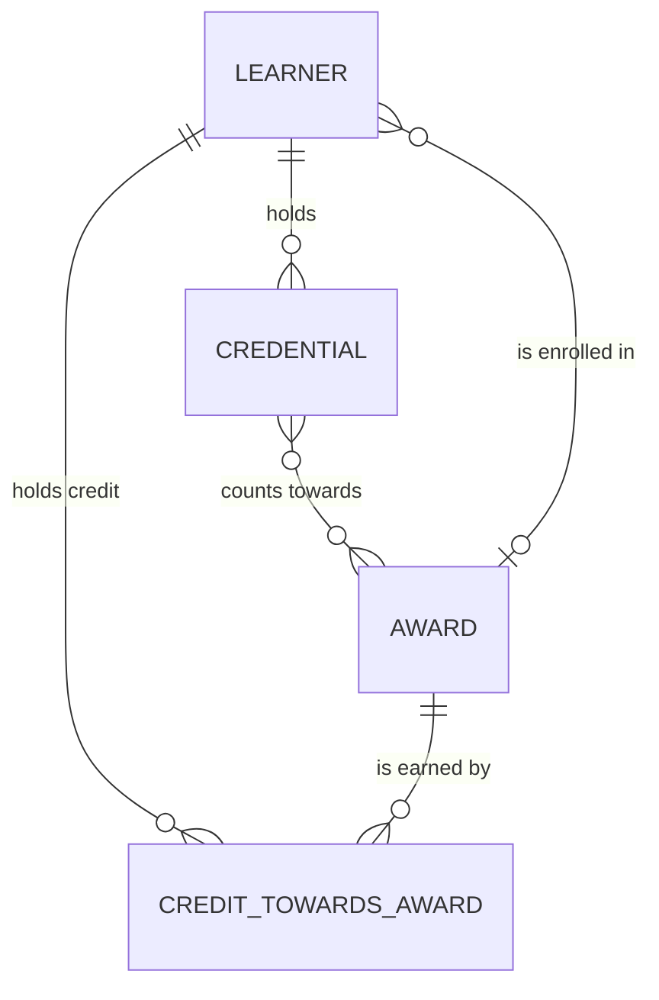

# In the weeds of data crafting · Written once: script

*The script of Written once, the closing film of In the weeds of data crafting, a technical series for analytics engineers, as planned: about 4:40 (target 4 to 6 minutes), in eight chapters, in English, 30 September 2026. The narration lives in [`source/src/narration.js`](source/src/narration.js) and the pauses in [`source/src/breath.js`](source/src/breath.js); this page and those files say the same thing, and where they differ, the source wins. The timings are estimates from the word count (608 words, at the pace of the opening film, with the holds) until the voice is recorded; the pacing report replaces them. Takes steps 9 and 10 of Jun's ten, keeping each fact written once and letting the model change without breaking anyone, and closes the loop the opening film drew.*

## The promise

A practitioner follows every line, and a data architect agrees with it. Every copy of a fact is a chance for it to drift, so each fact gets one home. Meaning (what a thing is, its key, its owner) lives in the conceptual model, `model/conceptual.yml`; decisions and accepted gaps live in Markdown, because they hold *why*; everything the build uses (grain, keys, contracts, tests, owners) lives in dbt's YAML. Everything else is driven from those homes, in one direction: a script generates doc blocks from the conceptual model, dbt's YAML points to them with `doc()`, the physical diagram is generated from what dbt parsed, and on Databricks the build pushes descriptions to the catalog. CI fails when a generated file is out of date. The conceptual diagram is drawn by hand, because it shows meaning; the physical one is generated, because it shows structure. And written once doesn't mean frozen: a breaking change to a public model is a new version beside the old one, with a deprecation date, the consumers found through lineage and exposures, and dbt's warning for anyone still on the old one. **One home per fact. Everything else, generated.**

## The story in one paragraph

From 1833, a ball on a mast above the Royal Observatory at Greenwich dropped at one o'clock, and ships on the Thames set their clocks by it; from 1852, a master clock dropped it and sent its time down wires, to a clock at the gate and along the railways, and nobody set those clocks by hand. A definition can work the same way. Jun's pull request is merged, but a planner notices that the census dashboard's tooltip and the wiki disagree about what an award is. The agent finds the definition in four places: the wiki, a YAML description, the catalog and the tooltip. Three have drifted (given "on paper"; no credit points; "a degree"), and only one still says what Mei approved. The fix isn't a fifth copy: it's one home per fact. Meaning goes in the conceptual model; decisions and accepted gaps in Markdown; what the build uses in YAML. A script turns each definition into a doc block on a page nobody edits; the YAML points to it by name; the agent's review finds no description written twice. The conceptual diagram stays hand-drawn; the physical one is generated from the manifest, and CI fails if it's stale. On Databricks, the build pushes descriptions to the catalog, and nobody edits them there. Then the model changes: a credential can expire, and `is_revoked` can't say so, so `core_credential` gets a version 2 with `status`; version 1 is built from version 2 until 31 March 2027; lineage finds one exposure to tell, the wallet app, which pins version 2; anyone still on version 1 gets dbt's warning with the date. The loop of ten steps closes, every station with a teal dot and a gold tick, and a new question arrives from the wallet team. Declare it. Then build it.

## What each object stands for

| Object | Stands for |
|---|---|
| "1833 · Greenwich"; a ball rising up a mast on the Observatory roof, then dropping | One signal, at one moment, that everyone can set by |
| Ships on the river, their clocks set as the ball drops | Everyone who relies on the one source |
| "1852"; a master clock sending pulses down wires to the gate clock and a railway clock, hands moving in step | Copies driven from one source, not set by hand |
| The gate clock drifting into the present, becoming a definition card | A definition, kept in one place and sent out |
| Four cards: a wiki page, a YAML description, a catalog entry, a dashboard tooltip; three turn amber, the drifted words underlined | Copies of one definition, drifting (drawn, labelled "as it drifts": not project files) |
| The teal orb, searching; four pins on the four cards | The agent's metadata review, with evidence |
| Two columns: Markdown and YAML, with a third home above them, the conceptual model | One home per fact |
| A thin arrow from `model/conceptual.yml` through a cog (`scripts/definitions.py`) to `docs/definitions.md`, then to `doc("award")` in YAML, then to the docs site | Written once, shown everywhere: one direction |
| A small cog on a file's corner | A generated file: nobody edits it |
| A red cross on a CI check, then green | A check that a generated file is current |
| A hand-drawn diagram (white on blue) beside a generated one (on glass, with a cog) | Draw the meaning; generate the structure |
| A catalog panel on the right, labelled "Databricks · Unity Catalog", with descriptions flowing in, and a hand's edit fading | One direction of sync |
| Two stacked cards, `core_credential` v2 (lit) and v1 (dimmer, with a date tag "31 Mar 2027") | A new version beside the old one, with a deprecation date |
| A lineage line from `core_credential` to one exposure badge, the wallet app | Who to tell |
| An amber warning line under an old consumer | dbt's deprecation warning |
| The loop of ten steps from the opening film, every station lit with a teal dot and a gold tick | The series, closed |
| A new question card landing at the first station | The loop begins again |

## Script

### 1 · One clock · 0:00–0:38

**Narration.** In 1833, a ball went up on a mast above the Royal Observatory, at Greenwich. At one o'clock exactly, it dropped, and ships on the Thames set their clocks by it. From 1852, a master clock dropped it, and sent its time down wires: to a clock at the gate, and out along the railways. Nobody set those clocks by hand. A definition can work like that: kept in one place, and sent out from there.

**Picture.** The warm past, with "1833 · Greenwich" in the corner. The Observatory's roofline on its hill above the river; a ball rises up its mast (a low rope creak), waits, and drops (a thud). Below, on the Thames, sailing ships; on "set their clocks", a chronometer's hands click to one o'clock in a close-up. "1852": a master clock on a wall inside; wires run from it, drawn as lines of light, to a large 24-hour clock at the gate, and away to a railway station's clock; on "down wires", all their hands move in step with the master's. On "by hand", a hand reaches towards the gate clock's hands and pulls back: they're already right. On the bridge line, the gate clock's dial drifts right, towards the present, and becomes a card: "award · one definition". Wordless breather: the title card over the gate clock and the ball, with the series' mark (on a felt piano): "IN THE WEEDS OF DATA CRAFTING", *Written once*, "one home per fact; everything else driven from it".

**On screen.** 1833 · Greenwich · one o'clock · ships set their clocks · 1852 · a master clock · wires · the gate · the railways · nobody set them by hand · kept in one place · sent out from there · *Written once* · one home per fact; everything else driven from it

### 2 · Four copies · 0:38–1:13

**Narration.** A planner notices that the dashboard's tooltip and the wiki disagree about what an award is. Jun asks the agent to look. It finds the definition in four places: the wiki, a YAML description, the catalog, and the tooltip. One says an award is given on paper. One has lost its credit points. One calls every award a degree. Only one still says what Mei approved. Nobody set out to change the meaning. The copies drifted, one small edit at a time.

**Picture.** The films' dark glass. Planning's census dashboard (the consumer badge), a tooltip open over "award"; beside it a wiki page; a small red mark between the two. Jun, then the teal orb, which sweeps the project and beyond it and pins four cards, each labelled as it's named (four copies drifting: a detuned felt pair, once). Each card carries a small tag, "as it drifts". The four copies:

- wiki: "A qualification the university confers **on paper**, such as a graduate certificate or a master, for a set number of credit points."
- YAML description: "A qualification the university confers, such as a graduate certificate or a master." (**credit points** missing, the gap underlined)
- catalog: "A **degree** the university confers, for a set number of credit points."
- tooltip: the definition as Mei approved it, from the project:

```yaml
# model/conceptual.yml · runs on dbt Core · DuckDB
  - name: award
    definition: >
      A qualification the university confers, such as a graduate certificate or a master, for
      a set number of credit points. When it's conferred on a learner, it's a credential too.
    owner: Mei Tanaka, registrar's office
```

On "drift", three cards turn amber, each drifted phrase underlined. On "only one", the fourth stays white, with Mei's small gold tick beside it. On "one small edit at a time", each amber card rewinds a few edits, faintly: each edit small, each one reasonable.

**On screen.** the tooltip · the wiki · they disagree · four places · wiki · YAML description · catalog · tooltip · as it drifts · on paper · no credit points · a degree · what Mei approved · one small edit at a time

### 3 · What goes where · 1:13–1:49

**Narration.** The fix isn't a fifth copy, or a better one. It's one home for each fact, and everything else driven from it. Meaning lives in the conceptual model: what each thing is, its key, and who owns it. Decisions live in Markdown, with why and who. So do the gaps the team accepted. Everything the build uses lives in YAML: grain, keys, contracts, tests and owners. A decision log isn't a copy. It holds why, and the YAML can't.

**Picture.** The four cards slide aside. Three homes draw in, each labelled as it's named: at the top, the conceptual model (white on blue, the blueprint's colour); below it, two columns, Markdown and YAML. On "meaning", the award's lines from `model/conceptual.yml` light (definition, business key, owner). On "decisions", the decision log's row for this change types into the Markdown column:

```markdown
<!-- docs/decisions.md · runs on dbt Core · DuckDB -->
| 14 Oct 2026 | Definitions are written once, in `model/conceptual.yml`, and generated into doc
blocks. The physical diagram is generated from the manifest. Descriptions go to Unity Catalog
with `persist_docs`. | Four copies of a definition drift apart. One home, and one direction of
sync, keeps them the same. | Jun Park and Noor |
```

On "gaps", a trimmed card from the gap register's known limitations:

```markdown
<!-- docs/gaps.md · runs on dbt Core · DuckDB -->
## Known limitations

The gaps accepted above, and what follows from them:

- **Revocation dates are the day a source stopped showing a credential as held.** …
- **An enrolment with no email gives a credential no one holds.** …
```

On "the build uses", the YAML column fills with small tags: grain, keys, contracts, tests, owners; beside it, the conventions' rules:

```markdown
<!-- docs/conventions.md · runs on dbt Core · DuckDB -->
## Metadata

- `meta.grain`: on every core and mart model, the grain in one sentence ("One row per
  credential"). The diagram in `docs/physical.md` reads it; a test proves it.
- `meta.owner`: who owns the meaning (models) or the data (sources, seeds).
- `meta.domain`: registrar, learning, planning or wallet.
- `meta.glossary_term`: the term in `model/conceptual.yml` a model or key holds.
…
- A description used in more than one place is a doc block, written once (`docs/columns.md`);
  a definition is written once, in `model/conceptual.yml`.
```

On "a decision log isn't a copy", the decision row's "Why" column lights gold-edged, and an empty space in the YAML column beside it: YAML has no place for why.

**On screen.** not a fifth copy · one home per fact · the conceptual model · what it is · its key · its owner · Markdown · decisions · why · who · accepted gaps · YAML · grain · keys · contracts · tests · owners · a decision log holds why

### 4 · Written once, shown everywhere · 1:49–2:24

**Narration.** So the award is defined once, in the conceptual model. A script turns each definition into a doc block, on a Markdown page it writes itself. Nobody edits that page. The YAML doesn't copy the definition. It points to it, by name, and dbt shows it wherever it's pointed to. To change the meaning, change one line, with Mei's approval. Edit the generated page instead, and the check in CI fails. The agent's review runs again: no description written twice.

**Picture.** A chain draws left to right, each link a card, lighting as it's named. First, the conceptual model's header:

```yaml
# model/conceptual.yml · runs on dbt Core · DuckDB
# The conceptual model: the slice of the credential model (v3) that Planning's question touches.
#
# Not parsed by dbt (it sits outside model-paths). It's where the meaning is written once:
# scripts/definitions.py turns each definition into a doc block in docs/definitions.md, which
# the dbt YAML shows with doc() and Databricks pushes to Unity Catalog.
```

Then the script (a cog turns; a generated file writing: muffled keys):

```python
# scripts/definitions.py · runs on dbt Core · DuckDB
"""Writes docs/definitions.md and seeds/key_sets.csv from model/conceptual.yml.

The meaning is written once, in the conceptual model. This script turns it into doc blocks, the
dbt YAML shows them with doc(), and on Databricks persist_docs pushes them to Unity Catalog.
The key sets are written once there too; the seed the models join to is generated from them.

    python scripts/definitions.py           # write docs/definitions.md and seeds/key_sets.csv
    python scripts/definitions.py --check   # fail if either is out of date
"""
```

Then the generated page, with a small cog on its corner:

```markdown
<!-- docs/definitions.md · runs on dbt Core · DuckDB -->
# Definitions

*Generated by `scripts/definitions.py` from `model/conceptual.yml`. Edit the conceptual model,
then run the script; don't edit this file.*
…

**Award.** A qualification the university confers, such as a graduate certificate or a master,
for a set number of credit points. When it's conferred on a learner, it's a credential too.

- Business key: The award code, qualified by its key set, SIS|GCDA. Issued by: Registrar's office.
- Owner of the meaning: Mei Tanaka, registrar's office.
- History: Every version, dated when it was recorded.

```

Then the YAML that points to it, `doc("award")` lit:

```yaml
# models/core/_core__models.yml · runs on dbt Core · DuckDB
  - name: core_award
    description: >
      An award the university offers, as it stood from valid_from until valid_to.
      {{ doc("award") }}
```

and the docs site's page for `core_award`, the definition shown in full. On "one line", the definition's line in `model/conceptual.yml` lights, and Mei's gold tick lands beside it. On "edit the generated page", a hand types "on paper" into `docs/definitions.md`; a CI check draws red (a muted double knock) with its real message, `docs/definitions.md is out of date: run python scripts/definitions.py`; the edit fades, the check turns green. On "runs again", the teal orb's result card:

```
$ python skills/review-metadata/find_repeats.py
0 description(s) written more than once
```

**On screen.** defined once · model/conceptual.yml · a script · doc blocks · docs/definitions.md · generated · don't edit this file · doc("award") · shown wherever it's pointed to · one line · Mei's approval · the check fails · 0 descriptions written twice

### 5 · Diagrams that can't drift · 2:24–2:51

**Narration.** Diagrams drift too. The conceptual diagram is drawn by hand, for people. It changes only when the meaning does. The physical diagram is generated: every core and mart table, its columns, types and keys, read from what dbt parsed. If the YAML changes and the diagram doesn't, CI fails. Draw the meaning. Generate the structure.

**Picture.** A diagram on an old wiki page, dated last year, fades amber. Two diagrams draw side by side. Left, white on blue, the hand-drawn one:

~~~~markdown
<!-- docs/conceptual-model.md · runs on dbt Core · DuckDB -->

~~~~

rendered as it types (five entities' boxes, five lines). Right, on glass with a cog, the generated one:

```markdown
<!-- docs/physical.md · runs on dbt Core · DuckDB -->
# Physical model

*Generated by `scripts/diagrams.py` from `target/manifest.json`. Don't edit this file: change the
YAML, run `dbt parse`, then run the script. CI fails if it's out of date.*
…
    core_award_v1 {
        string award_key PK
        string award_bk
        date valid_from PK
        …
```

rendered as tables with columns and types. On "if the YAML changes", a column's type changes in `_core__models.yml`; the right-hand diagram goes amber and the CI step draws red; the script runs, the diagram updates, and the step goes green. The two CI steps from the workflow (repository root):

```yaml
# .github/workflows/credential-project.yml · runs on dbt Core · DuckDB
      - name: Doc blocks and key sets match the conceptual model
        run: python scripts/definitions.py --check

      - name: Physical diagram matches the YAML
        run: python scripts/diagrams.py --check
```

and their real output: `docs/definitions.md and seeds/key_sets.csv are up to date` · `docs/physical.md is up to date`. On "Draw the meaning. Generate the structure.", the two diagrams settle side by side, each with its label.

**On screen.** diagrams drift too · conceptual · drawn by hand · for people · physical · generated · every table · columns · types · keys · from what dbt parsed · CI fails if it's out of date · draw the meaning · generate the structure

### 6 · One direction · 2:51–3:21

**Narration.** On Databricks, people find tables in the catalog, and read their descriptions there. So each build pushes the descriptions out to it, for every table and every column. Nobody edits them there: the next build would write over the edit. Fix it at home, and it flows out. One direction: from the files, out to the catalog and whatever reads it. Like the clock at the gate.

**Picture.** A catalog panel on the right, labelled "Databricks · Unity Catalog" (the story's stack, in the dim label the series uses for it): `core_award`, its description and its columns' comments. The setting lights:

```yaml
# dbt_project.yml · runs on dbt Core · DuckDB
models:
  credentials:
    # Databricks only: push descriptions to Unity Catalog. DuckDB leaves them in the docs site.
    +persist_docs:
      relation: "{{ target.type == 'databricks' }}"
      columns: "{{ target.type == 'databricks' }}"
```

On "pushes", descriptions flow along one arrow from the files into the catalog panel, table then columns. On "nobody edits them there", a hand types a change into the catalog's description; on "write over", a build runs and the text returns to the definition. On "at home", the change is made in `model/conceptual.yml` instead, and it flows through the chain of the chapter before and out to the catalog. On "whatever reads it", the dashboard's tooltip, now drawn reading from the catalog rather than holding a copy. On "the clock at the gate", a brief echo of the past: the master clock's wire to the gate clock, then back.

**On screen.** Databricks · Unity Catalog · descriptions · persist_docs · every table · every column · nobody edits them there · the next build writes over it · fix it at home · one direction · like the clock at the gate

### 7 · The next version · 3:21–4:10

**Narration.** Written once doesn't mean never changed. A credential can expire, and a true or false can't say so. So `is_revoked` becomes status: valid, expired or revoked. That breaks anyone who reads the old column. So it's a new version of the credential, beside the old one. Version one is built from version two, so the logic lives once. And it has a date to go: the 31st of March, 2027. Lineage says who to tell: one exposure, the wallet app. The wallet pins version two. Anyone still reading version one gets dbt's warning, with the date, every time they build. A breaking change arrives as a choice with a deadline, not as a surprise.

**Picture.** `core_credential` as its product card from *Who owns what*. On "expire", a column `is_revoked` (true, false) and beside it `status` with three values, `expired` lit as the one a true-or-false can't hold. On "breaks", a line from the old column to a consumer strains. The card splits into two stacked cards, v2 in front (the version stamp: a low stamp), v1 behind. The versions:

```yaml
# models/core/_core__models.yml · runs on dbt Core · DuckDB
    versions:
      - v: 2
        …
      - v: 1
        deprecation_date: 2027-03-31
        description: >
          Version 1: a credential issued to a learner, with is_revoked in place of status.
          Deprecated: status replaces is_revoked in version 2, because a credential can also
          expire. Built from version 2 until 31 March 2027.
        …
        columns:
          - include: all
            exclude: [learner_bk, status, revoked_on, loaded_at]
          - name: is_revoked
```

On "built from version two", an arrow from v2 to v1:

```sql
-- models/core/core_credential_v1.sql · runs on dbt Core · DuckDB
-- Version 1, built from version 2 until its deprecation date: the logic lives once.
with

credentials as (

    select * from {{ ref('core_credential', v=2) }}
…
    status = 'revoked' as is_revoked
```

On the date, a tag "31 Mar 2027" hangs on v1. On "lineage", the lineage graph lights from `core_credential` rightwards to the wallet's two marts, and on to one exposure badge; Planning's dashboard stays dark (it doesn't read the credential):

```
$ dbt ls --select core_credential+ --resource-type exposure
exposure:credentials.wallet_app
```

On "pins", the wallet's mart:

```sql
-- models/marts/wallet/mart_wallet__credentials.sql · runs on dbt Core · DuckDB
credentials as (

    select * from {{ ref('core_credential', v=2) }}

),
```

The wallet team, told, gives its gold tick. On "warning", a small model still reading version 1 draws, and dbt's real warning types beneath it, amber (trimmed):

```
[WARNING]: While compiling 'mart_wallet__old_reader': Found a reference to
core_credential.v1, which is slated for deprecation on '2027-03-31T00:00:00+00:00'.
A new version of 'core_credential' is available. Try it out:
{{ ref('credentials', 'core_credential', v='2') }}.
```

On "a choice with a deadline", the decision row: `13 Oct 2026 · core_credential version 2 replaces is_revoked with status … · Noor and Mei Tanaka; the wallet app team told`, with Noor's and Mei's gold ticks.

**On screen.** written once ≠ never changed · is_revoked · status · valid · expired · revoked · breaks the old column · a new version · v2 · v1 · built from v2 · the logic lives once · deprecation 31 Mar 2027 · lineage · one exposure · wallet_app · pins v2 · dbt's warning · a choice with a deadline · not a surprise

### 8 · The loop closes · 4:10–4:41

**Narration.** That's the loop. A question, the sources, the consumers, gaps and contracts, tests, layers, checks, review, written once, and change. At every step, the agent drafted and checked. At every step, a person approved. And a new question arrives, from the wallet team. The loop starts again, at the question. Declare it. Then build it.

**Picture.** The loop of ten stations from the opening film, drawn as it was, lighting one by one as the steps are named, each with its glyph; at each, a teal dot and a gold tick, already there from the films before. Along the loop, once, the people of the series, each at the station where they approved: Planning at the question, Mei at the sources and the meaning, the learning team at the warn-and-stop, Noor at the model and the versions, the wallet team at its contract, Jun at review. On "a new question", a card lands at the first station, with the wallet's consumer badge; the first station lights again, and the teal orb moves towards it. On "Declare it. Then build it.", the credential blueprint (white on blue) settles over the lineage graph, as it did at the end of the opening film. Wordless end card: *Written once* · "One home per fact. Everything else, generated." · In the weeds of data crafting. The mark plays on the felt piano, then is answered by the opening film's electric piano, and resolves on D major.

**On screen.** a question · the sources · the consumers · gaps and contracts · tests · layers · checks · review · written once · change · the agent drafts and checks · a person approves · a new question · the wallet team · Declare it. Then build it. · *Written once* · One home per fact. Everything else, generated.

## Pause and think

Four stops, one question each.

| After | Question | Answer, in short |
|---|---|---|
| 2 · Four copies (`four`) | Which copy is right? | The one the others should be generated from, and it has to be found before the rest are fixed: here, the definition Mei approved, in `model/conceptual.yml`. Fixing the three wrong copies by hand only makes four copies again. |
| 3 · What goes where (`where`) | Is a decision log duplication? | No. The YAML says what is true now; the log says why, when and who decided. Nothing in the build holds that, and without it the next person reopens the decision. |
| 5 · Diagrams that can't drift (`diagrams`) | Why draw one diagram by hand and generate the other? | The conceptual diagram shows meaning, which only people decide, and changes rarely; drawn by hand, it can say what matters and leave out the rest. The physical diagram shows structure, every table, column and key, which changes with every YAML edit; drawn by hand, it would be out of date within a week. |
| 7 · The next version (`version`) | When is a change breaking? | When a consumer that reads the model as it is would get an error or a different meaning: a column removed or renamed, a type changed, a grain changed, a value's meaning changed. Adding a column usually isn't. A breaking change to a public model is a new version, with a deprecation date and the exposures told. |

## Rigour sheet

| Chapter | What the film says | What an expert would add, or what it simplifies |
|---|---|---|
| 1 | In 1833, a ball went up on a mast above the Royal Observatory, at Greenwich; at one o'clock exactly, it dropped, and ships on the Thames set their clocks by it. | Installed under the Astronomer Royal John Pond in 1833, on the roof of Flamsteed House; one of the first public time signals. It rises halfway at 12:55, to the top at 12:58, and drops at 13:00, so observers could be ready. Captains set or checked their marine chronometers by it. |
| 1 | From 1852, a master clock dropped it, and sent its time down wires: to a clock at the gate, and out along the railways. | Charles Shepherd's electric master clock, installed in 1852, released the ball automatically and drove slave dials, among them the Shepherd Gate Clock (a 24-hour dial, still at the Observatory's gate); by 1853 it also drove a clock at the South Eastern Railway's London Bridge terminus and sent time signals along the principal railways out of London. The film's "along the railways" is that. |
| 1 | Nobody set those clocks by hand. | The slave dials were moved by the master clock's electric impulses; the master clock itself was checked against astronomical observations. The ball still drops at one o'clock every day (it's lowered and kept down in high winds, and has been out of service for repairs at times): left out of the narration. |
| 1 | A definition can work like that clock. | The series' metaphor: one source, copies driven from it. |
| 2 | The definition of an award in four places; three drifted. | The four copies are drawn, not project files: the wiki page, the tooltip and the drifted YAML and catalog texts don't exist in the project, which holds only the one definition (`model/conceptual.yml` 75-83). They're labelled "as it drifts" on screen. The story follows the last film's hand-off. |
| 2 | Jun asks the agent to look; it finds four copies. | `skills/review-metadata/SKILL.md` covers the project's YAML and Markdown: generated files current (step 1), descriptions written word for word more than once (step 2, `find_repeats.py`), definitions outside the conceptual model (step 3). The wiki and the dashboard are outside the project; in the story the agent searches them too, with the planner's question as the lead. `find_repeats.py` finds only exact repeats; near-repeats, the drift, are for step 3's reading (the skill says so). |
| 3 | Meaning lives in the conceptual model; decisions and accepted gaps in Markdown; what the build uses in YAML. | `model/conceptual.yml` 1-7 (header), 75-83 (award); `docs/decisions.md` 22; `docs/gaps.md` 19-29; `docs/conventions.md` 84-91. The conceptual model is YAML, not Markdown: meaning is written as data so a script can generate from it; the hand-drawn diagram and its reading are Markdown (`docs/conceptual-model.md`). |
| 3 | A decision log isn't a copy; it holds why. | `docs/decisions.md` has columns Date, Decision, Why, Who. dbt's YAML has no field for rationale; `meta` could hold it, but then it would be a second home. |
| 4 | A script turns each definition into a doc block, on a page it writes itself. | `scripts/definitions.py` 1-9; it also generates `seeds/key_sets.csv` from the key sets. Doc blocks are dbt's `…` in any `.md` file under `docs-paths` (`dbt_project.yml` 10), shown with `{{ doc("name") }}` in a description. |
| 4 | The YAML points to it, by name, and dbt shows it wherever it's pointed to. | `models/core/_core__models.yml` 94-97. dbt resolves `doc()` at parse; the resolved text is what the docs site shows and what `persist_docs` pushes. |
| 4 | Edit the generated page, and the check in CI fails. | Run 30 September 2026 on a scratch copy: after editing the award's definition, `python scripts/definitions.py --check` printed "docs/definitions.md is out of date: run python scripts/definitions.py" and exited 1 (the same holds for a hand edit of `docs/definitions.md`, since the check compares the file with what the script would write). CI runs it: `.github/workflows/credential-project.yml` 46-47 (repository root). |
| 4 | The agent's review runs again: no description written twice. | `python skills/review-metadata/find_repeats.py` on the project, 30 September 2026: "0 description(s) written more than once". It skips descriptions that use `doc()`. |
| 5 | The conceptual diagram is drawn by hand; the physical one is generated from what dbt parsed. | `docs/conceptual-model.md` 7-14 (Mermaid `erDiagram`, drawn by hand); `docs/physical.md` 1-3 and the diagram from line 7, generated by `scripts/diagrams.py` from `target/manifest.json` (core and marts at their latest versions: columns with contracted types, PK from primary-key constraints, FK from relationships tests). Mermaid renders on GitHub; whether dbt's docs site renders Mermaid in a doc block is to check on the day, so the film shows the diagrams as rendered pages, not as the dbt docs site. |
| 5 | If the YAML changes and the diagram doesn't, CI fails. | `.github/workflows/credential-project.yml` 49-50: `python scripts/diagrams.py --check`, after `dbt build` (which writes the manifest). Both checks passed on 30 September 2026: "docs/definitions.md and seeds/key_sets.csv are up to date", "docs/physical.md is up to date". |
| 6 | On Databricks, each build pushes the descriptions to the catalog, for every table and every column. | dbt's `persist_docs` config, `relation` and `columns`: dbt-databricks writes them as table and column comments, which Unity Catalog shows. `dbt_project.yml` 21-26 turns it on for Databricks only; on DuckDB the descriptions stay in dbt's docs site. Views and tables both take comments; column comments on views depend on the adapter version (to check on the day). |
| 6 | The next build would write over an edit made in the catalog. | For models rebuilt as tables (`create or replace`), the comment is set again from the YAML on every build. For `core_credential` v2, incremental, dbt-databricks re-applies `persist_docs` comments on incremental runs (to confirm against the adapter's docs on the day). Simplified to "the next build". |
| 6 | Whatever reads the catalog. | The dashboard's tooltip reading from the catalog is drawn as the fix, not a feature of the project; Databricks tools that read Unity Catalog comments (Catalog Explorer, and assistants that use table metadata) show them. |
| 7 | A credential can expire; a true or false can't say so; `is_revoked` becomes `status`. | `docs/decisions.md` 21 (13 Oct). `status` accepts `valid`, `expired`, `revoked` (`_core__models.yml` 239-245); no source records an expiry yet, so nothing sets `expired` (`docs/gaps.md` 17, gap 10). Built 30 September 2026: v2 holds 53 credentials, 52 valid and 1 revoked (Jordan's microcredential `LMS|B-5028`, revoked 12 Aug 2026); v1 holds the same 53, 1 with `is_revoked` true. |
| 7 | That breaks anyone who reads the old column; so it's a new version, beside the old one. | dbt model versions: `versions:` with `v:`, `latest_version`, and per-version columns (`include`/`exclude`). `models/core/_core__models.yml` 175 (`latest_version: 2`), 252-277. Each version is its own table (`core_credential_v1`, `core_credential_v2`). An unpinned `ref('core_credential')` resolves to the latest version. |
| 7 | Version one is built from version two, so the logic lives once. | `models/core/core_credential_v1.sql` 1-6, 20. A project choice, not a dbt rule: each version can have its own SQL. |
| 7 | It has a date to go: 31 March 2027. | `deprecation_date: 2027-03-31` (`_core__models.yml` 262). dbt doesn't drop the model on that date; it warns. After the date the owner removes the version. |
| 7 | Lineage says who to tell: one exposure, the wallet app. | `dbt ls --select core_credential+ --resource-type exposure` on 30 September 2026: `exposure:credentials.wallet_app`. Planning's `census_dashboard` reads credit, not credentials, so it isn't downstream. The exposure names its owner (`_wallet__models.yml` 138-152). |
| 7 | The wallet pins version two. | `models/marts/wallet/mart_wallet__credentials.sql` 3-7; `mart_wallet__learners.sql` 23 too. |
| 7 | Anyone still reading version one gets dbt's warning, with the date, every time they build. | Run 30 September 2026 on a scratch copy with `models/marts/wallet/mart_wallet__old_reader.sql` holding `select * from {{ ref('core_credential', v=1) }}`: `dbt parse` warned "While compiling 'mart_wallet__old_reader': Found a reference to core_credential.v1, which is slated for deprecation on '2027-03-31T00:00:00+00:00'. A new version of 'core_credential' is available. Try it out: {{ ref('credentials', 'core_credential', v='2') }}." (dbt's `UpcomingReferenceDeprecation`; after the date it becomes `DeprecatedReference`.) The warning is raised whenever the referring model is parsed or compiled; "every time they build" simplifies that. Not committed. |
| 8 | The loop of ten steps; at every step the agent drafted and checked, and a person approved. | The loop from the opening film; `docs/process.md` and `AGENTS.md` 68-77 ("The agent recommends; people approve."). |
| 8 | A new question arrives, from the wallet team. | Illustrative: no second question is in the project. |

**Project files each snippet comes from** (checked against the files on 30 September 2026):

| Ch | File | Lines |
|---|---|---|
| 2 | `model/conceptual.yml` | 75-79 (the three drifted copies are drawn, not files) |
| 3 | `docs/decisions.md` | 22 (the table row, wrapped) |
| 3 | `docs/gaps.md` | 19-21, 23, 27 (trimmed with …) |
| 3 | `docs/conventions.md` | 84-89, 91 (trimmed with …) |
| 4 | `model/conceptual.yml` | 1-5 |
| 4 | `scripts/definitions.py` | 1-9 |
| 4 | `docs/definitions.md` | 1-3, 31-37 (line 3 wrapped) |
| 4 | `models/core/_core__models.yml` | 94-97 |
| 4 | `skills/review-metadata/find_repeats.py` | its output |
| 4 | `scripts/definitions.py --check` | its message (scratch copy) |
| 5 | `docs/conceptual-model.md` | 7-14 |
| 5 | `docs/physical.md` | 1-3, 9-12 (line 3 wrapped; the Mermaid fence left out; trimmed with …) |
| 5 | `.github/workflows/credential-project.yml` (repository root) | 46-50 |
| 6 | `dbt_project.yml` | 21-26 |
| 7 | `models/core/_core__models.yml` | 254-255, 261-266, 272-275 (trimmed with …) |
| 7 | `models/core/core_credential_v1.sql` | 1-6, 20 |
| 7 | `models/marts/wallet/mart_wallet__credentials.sql` | 3-7 |
| 7 | `dbt ls` | its output |
| 7 | dbt's warning (scratch copy) | wrapped to fit |
| 7 | `docs/decisions.md` | 21 (trimmed) |

**The run.** `dbt build --profiles-dir . --vars '{as_is_date: 2026-09-30}'` on 30 September 2026, dbt Core 1.12.5 with dbt-duckdb 1.11.0: PASS 143, WARN 1 (by design, gap 5), ERROR 0, 146 nodes. Every card carries the label `runs on dbt Core · DuckDB`; the catalog panel is labelled `Databricks · Unity Catalog`, the story's stack, where `persist_docs` is on.

**dbt and Databricks documentation** (the pages behind each claim; on 30 September 2026 docs.getdbt.com couldn't be reached from the build machine, so each claim was checked against the project's own runs and a web search; to confirm on the pages on the day):

- dbt: "Documentation" and doc blocks (docs.getdbt.com/docs/build/documentation), `doc()` (docs.getdbt.com/reference/dbt-jinja-functions/doc), `docs-paths` (docs.getdbt.com/reference/project-configs/docs-paths); `persist_docs` (docs.getdbt.com/reference/resource-configs/persist_docs); "Model versions" (docs.getdbt.com/docs/mesh/govern/model-versions) and `deprecation_date` (docs.getdbt.com/reference/resource-properties/deprecation_date), including the warning text; `latest_version` and `versions` (docs.getdbt.com/reference/resource-properties/versions); exposures (docs.getdbt.com/docs/build/exposures); node selection with `+` (docs.getdbt.com/reference/node-selection/graph-operators); "Coordinating model versions" (docs.getdbt.com/best-practices/how-we-mesh/mesh-6-coordinate-versions).
- Databricks: "Add comments to data and AI assets" (docs.databricks.com/aws/en/comments/) and `COMMENT ON` (docs.databricks.com/aws/en/sql/language-manual/sql-ref-syntax-ddl-comment); the dbt-databricks adapter's documentation persistence (github.com/databricks/dbt-databricks).

**Historical sources.**

- Royal Museums Greenwich, "The Greenwich Time Ball and one time for all" (rmg.co.uk/stories/time/greenwich-time-ball-one-time-all), and the collection record of the time ball (rmg.co.uk/collections/objects/rmgc-object-247981): 1833, John Pond, one o'clock.
- Graham Dolan, The Royal Observatory Greenwich, "The Greenwich Time Service" (royalobservatorygreenwich.org/articles.php?article=1084) and "The Shepherd Gate Clock" (article 1085): Shepherd's master clock and slave dials, 1852; the automatic release of the ball; the London Bridge terminus clock and the railway signals, by 1853.
- Checked in outline 30 September 2026 by a web search; the details of the rise times and the railway lines to confirm on the day.

## Labs

| # | Lab | Kind | The mechanism people break |
|---|---|---|---|
| 1 | *Find the home* | pick | Four copies of the award's definition (the three drifted ones and Mei's). Pick the one the others should come from, then fix the copies. Fix a copy by hand and the picture shows it drifting again at the next edit; fix the conceptual model and run the script, and every copy that points to it changes at once. Edit `docs/definitions.md` directly, and the CI check draws red with its real message. |
| 2 | *Where does it live?* | sort | Twelve facts into four homes: the conceptual model, Markdown, dbt's YAML, a var in `dbt_project.yml`. The award's definition; the learner's business key rule; why a microcredential is a kind of credential; an accepted gap; `core_award`'s grain; a column's type; a primary key; a test's severity; the census date; the 15 credit points; the owner of a model; the conceptual diagram. Put the 15 credit points in a doc's prose, and the picture shows the var changing to 20 while the doc still says 15. |
| 3 | *Plan a new version* | steps | Step through a breaking change to `core_credential`: add version 2 beside version 1; build version 1 from version 2; set `latest_version`; give version 1 a deprecation date; find the exposures with lineage; tell their owners; the consumer pins version 2; after the date, remove version 1. Skip "build version 1 from version 2" and the two versions' logic drifts; skip the date and version 1 never goes; remove version 1 before the consumer moves, and its build fails. |
| 4 | *Who's affected?* | count | Pick a model and count what's downstream: models, then exposures. From `core_credential`: two versions, the wallet's two marts, one exposure (`wallet_app`). From `core_credit_towards_award`: Planning's mart and its exposure (`census_dashboard`). Change a column in each and see which owners get told. |

## Scenarios

Eight situations, in this order.

1. **Spot the problem.** Someone fixes a typo in a table's description directly in Unity Catalog. (The next build writes over it: `persist_docs` pushes from the project. Fix it in `model/conceptual.yml` or the YAML, and it flows out.)
2. **Choose.** The physical diagram on the wiki is last year's. Redraw it, or link to `docs/physical.md`? (Link: the generated one can't drift, because CI fails when it's out of date. A redrawn copy starts drifting the day it's drawn.)
3. **True or false.** "A column rename in the core only affects one mart, so it isn't breaking." (False: a public model's rename breaks anyone who reads the column, inside the project or not. Lineage shows who's downstream today; the contract promised the name. A new version, with a date.)
4. **Spot the problem.** A page in `docs/` says "learners within 15 credit points of a graduate certificate". (The 15 lives once, as the var `near_award_credit_points`; the page should refer to the var. Change the var to 20 and the page is wrong, with no check to say so.)
5. **Explain.** Two columns' descriptions of `credit_points_earned` differ by one word, and `find_repeats.py` reports nothing. (It finds only word-for-word repeats. A near-repeat is drift, for a person, or the agent's reading step, to catch: make it one doc block in `docs/columns.md`, and ask the owner if the words mean different things.)
6. **Choose.** The wallet team ignores the deprecation warning until 1 April 2027. What happens? (After the date, dbt's warning becomes a deprecated-reference warning, and when the owner removes version 1, the wallet's build fails. The date was the deal; the owner decides whether to extend it, and says so.)
7. **Spot the problem.** Someone deletes `docs/decisions.md` "because it duplicates the YAML". (It doesn't: it holds why, when and who. The YAML holds what. Without the log, the next person reopens every decision.)
8. **Order.** A new question arrives from the wallet team: "which of a learner's credentials will expire in the next 90 days?" Put the first steps in order: write the question and its decision; learn what the sources hold (no source records an expiry: gap 10); define what the wallet needs; name the gap and decide it; write the tests; then build. (The loop again, from step one.)

## Pause and think

`four`, `where`, `diagrams`, `version` (the questions and answers are in [Pause and think](#pause-and-think) above).

## Decisions taken

| Date | Decision |
|---|---|
| 30 September 2026 | Open at Greenwich, 1833 and 1852: the time ball and Shepherd's master clock. One clock drives the rest; nobody sets them by hand. No bells in the sound. |
| 30 September 2026 | The four drifted copies are drawn, not files, labelled "as it drifts"; every other card is a project file with the label `runs on dbt Core · DuckDB`. The catalog panel carries `Databricks · Unity Catalog`. |
| 30 September 2026 | The deprecation warning and the failing `--check` are real output, from a scratch copy of the project; said so in the rigour sheet. |
| 30 September 2026 | The last chapter closes the series on the opening film's loop and its line, "Declare it. Then build it."; the end card's takeaway is "One home per fact. Everything else, generated." |

## Open

1. **Scratch experiments.** The deprecation warning (a model reading `core_credential` v1) and the failing `definitions.py --check` were run on a copy of the project; consider adding them as documented commands so viewers can repeat them.
2. **Mermaid in dbt's docs site.** Whether it renders a Mermaid block in a doc block: to check before the picture shows the diagram inside the docs site.
3. **`persist_docs` on incremental models** on Databricks: to confirm the comments are re-applied on incremental runs.
4. **Voice.** Check "eighteen thirty-three", "Greenwich", "is revoked", "dee bee tee", "see eye" and "May" by ear; file names, hashes and the warning's text stay on screen only.
5. **The learning team's face.** Drawn as Tom Whitfield in the last chapter's line-up, as the series plan proposes; to confirm.
