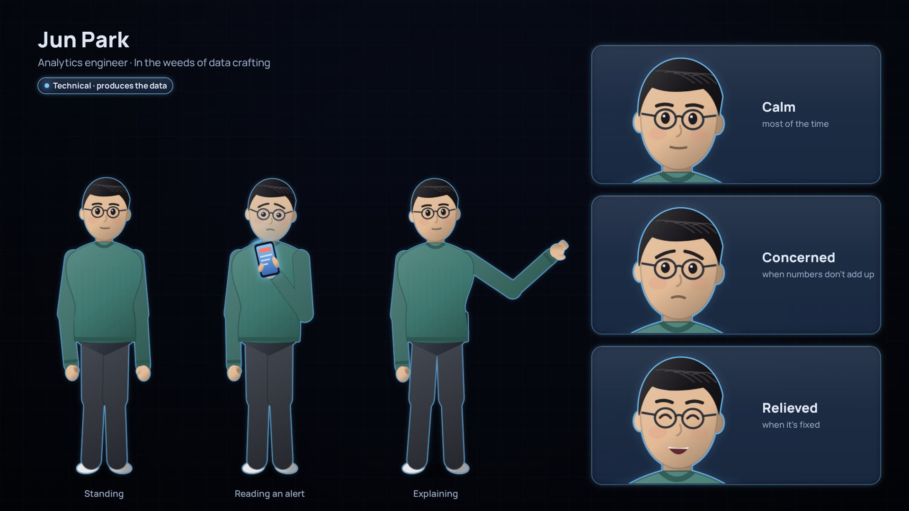

# The people: Jun Park

The series' one new character, drawn like the cast of *When things go wrong* ([their character sheet](../../when-things-go-wrong/characters/README.md)): Jun Park, the university's analytics engineer. Technical, so outlined in cyan; Jun builds what Noor, the architect, owns.

Jun is defined in [`../shared/src/people.js`](../shared/src/people.js), which adds Jun to the shared cast without changing `people.js`, so the published films stay byte for byte the same. `python render.py` draws the card with *When things go wrong*'s layout.
