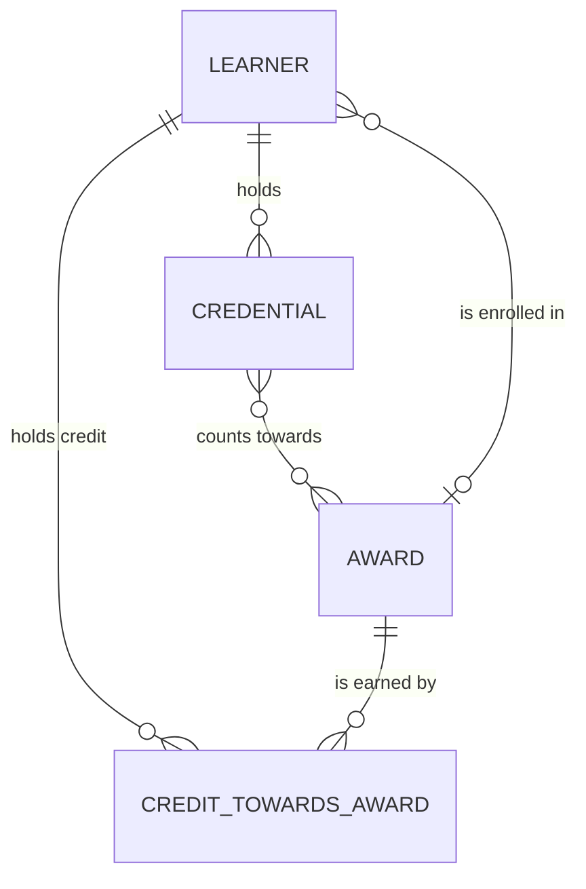

# Conceptual model

The slice of the credential model (v3) that Planning's question touches: learners, the
credentials they hold, the awards the university offers, and the credit a learner holds towards
an award. Drawn by hand, for people; the physical model is generated ([physical.md](physical.md)).

How to read it:

- A learner holds many credentials. Awards, microcredentials and badges are kinds of credential.
- A microcredential can count towards several awards, and an award recognises several.
- Credit towards an award belongs to a learner and an award together, and changes over time.
- A learner studies for one award at a time, in the student system.

Each entity's definition, business key, identity rules and owner are written once, in
[`model/conceptual.yml`](../model/conceptual.yml). dbt shows them through the doc blocks
generated from it ([definitions.md](definitions.md)).
