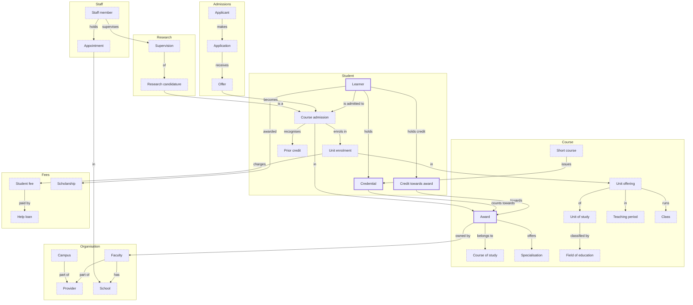

# The university's conceptual model

*Generated by `scripts/generate/definitions.py` from `_shared__conceptual.yml`, next to this file. Edit the map, then run the script; don't edit this file.*

The university's domains and their key entities, at a high level: 29 of at most 50. The domains follow the reference model, TCSI. A thick border is modelled in this project; a dashed one is planned. Each modelled domain has its own conceptual model, with the detail, in its folder.

| Domain | Owner | Entity | Status | Reference (TCSI) |
|---|---|---|---|---|
| student | Registrar's office | [learner](../core/student/_student__conceptual.yml) | modelled | Student, extended to learners with no award |
| student | Registrar's office | [credential](../core/student/_student__conceptual.yml) | modelled | Course outcome, extended to microcredentials and badges |
| student | Registrar's office | [credit_towards_award](../core/student/_student__conceptual.yml) | modelled | Extension: units passed and recognised microcredentials |
| student | Registrar's office | course_admission | planned | Course admission |
| student | Registrar's office | unit_enrolment | planned | Unit enrolment |
| student | Registrar's office | prior_credit | planned | Course prior credit |
| course | Registrar's office, with the faculties | [award](../core/course/_course__conceptual.yml) | modelled | Course |
| course | Registrar's office, with the faculties | course_of_study | planned | Course of study |
| course | Registrar's office, with the faculties | specialisation | planned | Course specialisation |
| course | Registrar's office, with the faculties | unit_of_study | planned | Unit of study |
| course | Registrar's office, with the faculties | unit_offering | planned | Extension: a unit of study and its census date, named |
| course | Registrar's office, with the faculties | teaching_period | planned | Extension: institutional |
| course | Registrar's office, with the faculties | class | planned | Extension: the timetabled activity, not in TCSI |
| course | Registrar's office, with the faculties | field_of_education | planned | Field of education |
| course | Registrar's office, with the faculties | short_course | planned | Extension: the short-course platform's offerings |
| organisation | Planning | provider | planned | Provider |
| organisation | Planning | campus | planned | Campus |
| organisation | Planning | faculty | planned | Extension: institutional; today an attribute of the award |
| organisation | Planning | school | planned | Extension: institutional |
| admissions | Admissions office | applicant | planned | Applicant |
| admissions | Admissions office | application | planned | Application |
| admissions | Admissions office | offer | planned | Offer |
| staff | People and culture | staff_member | planned | Staff |
| staff | People and culture | appointment | planned | Staff appointment |
| research | Graduate research school | research_candidature | planned | HDR course admission |
| research | Graduate research school | supervision | planned | Extension: institutional |
| fees | Finance | student_fee | planned | Student contribution and tuition fee |
| fees | Finance | help_loan | planned | HELP loans |
| fees | Finance | scholarship | planned | Commonwealth scholarships |

## Consumers

Each consumer has its own conceptual model: the question it asks, and what it adds to the core.

| Consumer | Asked by | Question | Uses |
|---|---|---|---|
| [finance](../marts/finance/_finance__conceptual.yml) | Finance | How much tuition does recognised credit save learners, by faculty, as at census date? | learner, award, credit_towards_award |
| [planning](../marts/planning/_planning__conceptual.yml) | Planning | How many learners are within 15 credit points of a graduate certificate, by faculty, as at census date? | learner, award, credit_towards_award |
| [wallet](../marts/wallet/_wallet__conceptual.yml) | The learner's wallet app | What does this learner hold now, and how far are they from the award they're enrolled in? | learner, credential, award, credit_towards_award |
