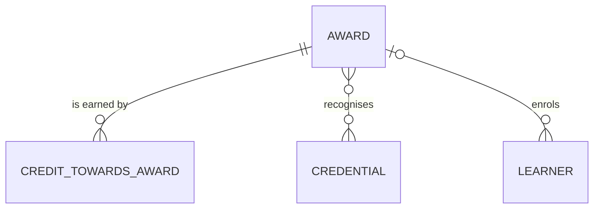

# Course domain: conceptual model

The awards the university offers. Drawn by hand, for people. Only the award is modelled so far;
the rest of the domain (course of study, unit of study, unit offering, and more) is on
[the university's map](../../_shared/_shared__conceptual.md), planned. The student domain's
entities that reach the award are shown for context.

How to read it:

- An award requires a set number of credit points, and belongs to a faculty.
- An award recognises some microcredentials towards its credit; the faculty decides which.
- When an award is conferred on a learner, it's a credential too, in the student domain.

The definition is written once, in [`_course__conceptual.yml`](_course__conceptual.yml), and shown
through [`_course__definitions.md`](_course__definitions.md). The physical model is generated
([`_course__physical.md`](_course__physical.md)).
