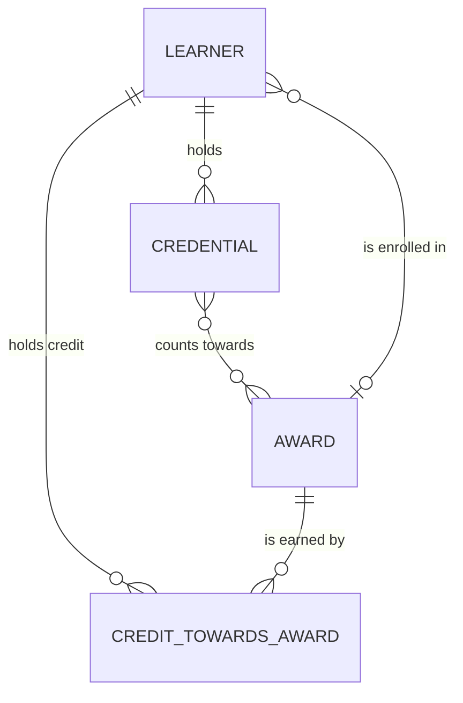

# Student domain: conceptual model

Learners, the credentials they hold, and the credit they hold towards an award. Drawn by hand,
for people. The award belongs to the course domain, and is shown here because the student
domain's relationships reach it. Where this domain sits among the university's other domains:
[the university's map](../../_shared/_shared__conceptual.md).

How to read it:

- A learner holds many credentials. Awards, microcredentials and badges are kinds of credential.
- A microcredential can count towards several awards, and an award recognises several.
- Credit towards an award belongs to a learner and an award together, and changes over time.
- A learner studies for one award at a time, in the student system.

Each entity's definition, business key, identity rules and owner are written once, in
[`_student__conceptual.yml`](_student__conceptual.yml). dbt shows them through the doc blocks
generated from it ([`_student__definitions.md`](_student__definitions.md)). The physical model is
generated too ([`_student__physical.md`](_student__physical.md)).
