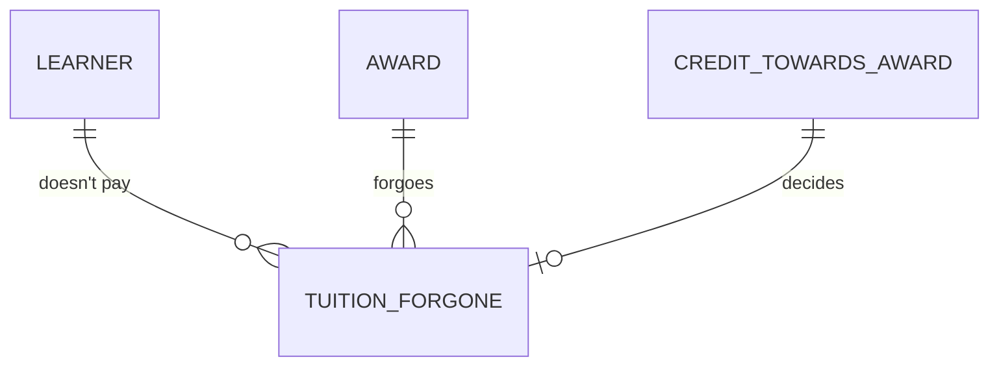

# Finance: conceptual model

What Finance sees: the tuition that recognised credit saves a learner, as at census date. Drawn
by hand, for people. It uses the core's entities as they were on the census date, and adds one
concept of its own.

How to read it:

- Tuition forgone is the tuition a learner doesn't pay for an award, because credit earned
  elsewhere was recognised towards it.
- Finance adds it up by faculty, as at census date.

The question, the decision it supports and the concept are written once, in
[`_finance__conceptual.yml`](_finance__conceptual.yml). The learner, the award and credit
towards an award are the core's ([student](../../core/student/_student__conceptual.yml),
[course](../../core/course/_course__conceptual.yml)).
