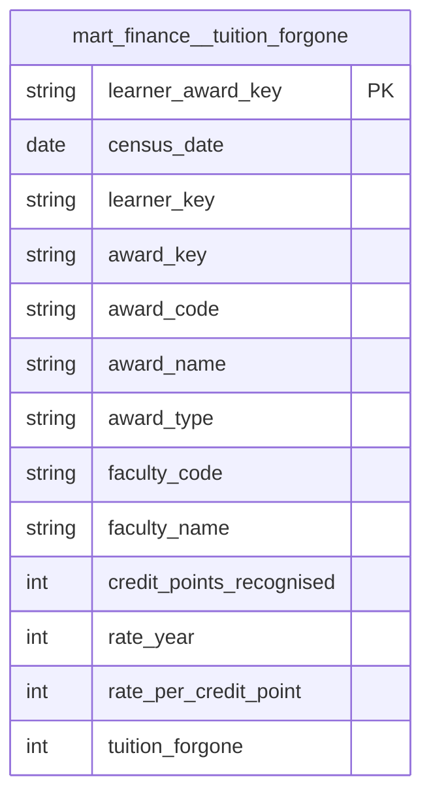

# Finance domain: physical model

*Generated by `scripts/generate/diagrams.py` from `target/manifest.json`. Don't edit this file: change the YAML, run `dbt parse`, then run the script. CI fails if it's out of date.*

The mart models of the finance domain (a consumer contract), at their latest versions: every column with its contracted type, primary keys (PK), and the relationships the tests check (FK). A model from another domain shows only the key a relationship uses; its own domain's page has the rest. `||--o{` points from a key that is unique; `}|--o{` from a key that has versions, so several rows share it.

| Model | Grain | Access | Contract |
|---|---|---|---|
| `mart_finance__tuition_forgone` | One row per learner per award they're enrolled in, as at census date. | protected | enforced |
