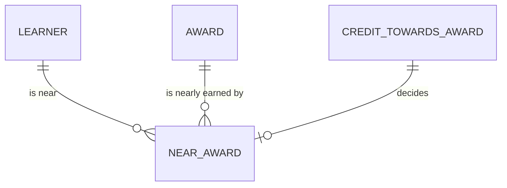

# Planning: conceptual model

What Planning sees: a learner near an award, as at census date. Drawn by hand, for people. It
uses the core's entities as they were on the census date, and adds one concept of its own.

How to read it:

- A learner is near an award when, on the census date, they were studying, enrolled in it, and
  had more than none and no more than 15 credit points left to earn towards it.
- Planning counts them by faculty. The rule and the count are written once, in
  `macros/planning/near_award.sql`, and the semantic layer's metric is the same count.

The question, the decision it supports and the concept are written once, in
[`_planning__conceptual.yml`](_planning__conceptual.yml). The learner, the award and credit
towards an award are the core's ([student](../../core/student/_student__conceptual.yml),
[course](../../core/course/_course__conceptual.yml)).
