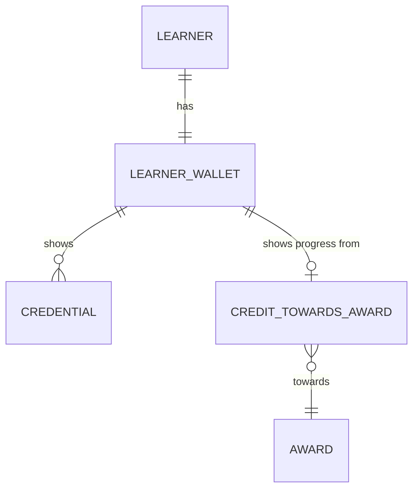

# Wallet: conceptual model

What the learner's wallet app shows: a learner's wallet, as it is now. Drawn by hand, for people.
It uses the core's entities at their version valid today, and adds one concept of its own.

How to read it:

- A learner has one wallet: the credentials they hold now, and their progress towards the award
  they're enrolled in.
- A revoked credential stays in the wallet, marked revoked.

The question and the concept are written once, in [`_wallet__conceptual.yml`](_wallet__conceptual.yml).
The rest is the core's ([student](../../core/student/_student__conceptual.yml),
[course](../../core/course/_course__conceptual.yml)).
