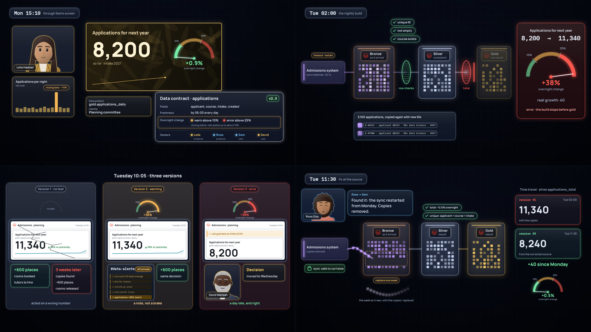

# Too good to be true · style frames

The checkpoint the [script](../script.md) sets before any animation: can the film's four new moments be drawn clearly in *The Inner Life of Data*'s design language? Each frame is drawn by the film's own components, in [`../source/src/good.js`](../source/src/good.js), with *Silent change*'s components and the series' characters, so what's approved here is what the film will use.



## The frames

| File | Chapter | What it shows |
|---|---|---|
| `gauge.jpg` | 2 · The number and its limits | The gold painting with one big number, 8,200, and its gauge: green up to 10%, amber to 25%, red beyond. The contract card lights its one line that matters, the overnight change. Leila, on a call, and last year's closing-date spike. |
| `rows-pass.jpg` | 3 · Monday night | Tuesday 02:00. The copies sit in bronze in pairs; three row checks pass, green; the test on the total, before gold, is red, and the way into gold is closed. The gauge: 8,200 → 11,340, +38%, when the real growth was 40. Below, one pair close up: same applicant, course and intake, two IDs. |
| `three-tuesdays.jpg` | 4 · Three Tuesdays | Three columns, one per version. No test: the committee's dashboard shows 11,340, the board says +600 places, and three weeks later the copies are found and the dashboard cracks. A warning: the gauge has no red band, the warning is one of forty unread, and the same decision is made. An error: the dashboard keeps 8,200 with its note, and David moves the decision to Wednesday. |
| `reload.jpg` | 7 · Fix at the source | Rosa's message; the sync, now safe to run twice; the affected week in bronze being replaced from the corrected source while the old copies leave; silver and gold rebuilt with the new business-key test; time travel's two versions, 11,340 and 8,240; the gauge back in green. |
| `frames.jpg` | | All four, two by two. |
| `frames.html`, `frames.js` | | The layouts. Open `frames.html` in a browser to see them drawn live. |
| `render.py` | | Saves the images. |

## Design choices

- **The gauge is the film's new object,** and it looks the same everywhere: on the painting, in the night's pipeline and in each Tuesday. With no test it's an empty dashed dial; as a warning only, it has no red band. So the three versions differ by the gauge alone, which is the film's point.
- **The admissions system has its own colour,** lilac, as each source system has one in *The Inner Life of Data*. Copies are a paler lilac, so pairs read as pairs.
- **The committee's screen is in the style of a Databricks dashboard,** like Ana's in *Silent change*, and uses the same amber note, so the note means the same in both films. Its "▲ 38%" is green, as a dashboard shows growth: it looks like good news, which is why nobody questions it.
- **Tone:** the no-test version is a little wry (the crack, "rooms released"), never mocking. The committee made a sensible decision on the number it was shown.
- **Nothing important below y 930,** where the captions go.

## What to decide

1. **The gauge's scale.** It runs from 0 to 40%, so +38% sits near the end of the red band. A wider scale would make 38% look less extreme; a narrower one would push the needle off the dial.
2. **The no-test column.** The crack across the dashboard stands for "nobody trusts it any more". It could instead be the number fading to grey.
3. **The painting or the dashboard.** The platform shows the gold painting; the committee's room shows the dashboard. Both carry the same number. That's how *Silent change* worked, but it's one more object to recognise.

**Suggested verdict:** the four moments read at a glance, and the gauge carries the idea without words. Next come the voice test and the scenes.

## Rendering

From this folder, with the packages of *The Inner Life of Data*'s source installed (`films/inner-life-of-data/source/requirements.txt`):

```
python render.py                 # every frame, in about ten seconds
python render.py gauge reload    # only those two
```
