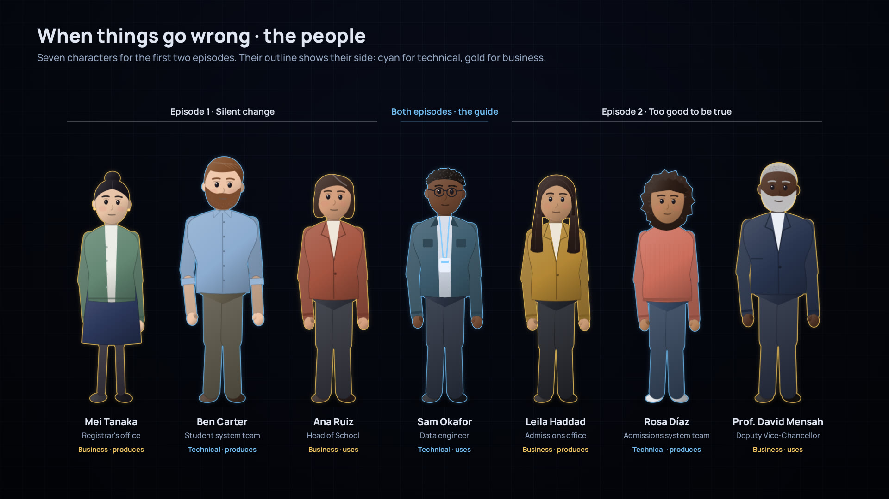

# The people: character sheet

First pass of the character sheet for [When things go wrong](../README.md), the checkpoint both treatments set before any script: can full characters, with faces, be drawn in code in the first film's design language? Everything here is drawn by code, like *The Inner Life of Data*.



## What's here

| File | What it shows |
|---|---|
| `lineup.jpg` | All seven characters, grouped by episode, with Sam in the middle as the guide |
| `card-<name>.jpg` | Each character in three poses (standing, reading an alert, explaining) and three expressions (calm, concerned, relieved) |
| `through-the-screen.jpg`, and `through-the-screen.mp4` once rendered | The shot that joins the two worlds: over Sam's shoulder at dawn, into the dashboard, then through the screen into the platform from the first film, where a red thread runs upstream from the data product to the student system |
| `people.js` | The characters: body, clothes, hair, faces, poses and expressions, as data plus drawing functions, ready for the films to reuse |
| `sheet.js`, `sheet.html` | The layouts. Open `sheet.html` in a browser to see them drawn live |
| `render.py` | Saves the images and the video |

## Design choices

- **The outline's colour carries meaning,** like every colour in the films: cyan for the technical side, gold for the business side. Together with the role, it places each person in the square of the series: technical or business, producing or using the data.
- **A simple, original style.** Rounded forms, soft light from the upper left, and faces made of a few lines: eyes, brows, a nose and a mouth are enough for calm, concerned and relieved. Characters blink and breathe, so they stay alive when still.
- **A varied cast, without stereotypes.** Different ages, skin tones and hair. The technical side isn't all men: in the second episode, Rosa Díaz runs the admissions system.
- **One world.** The platform seen through Sam's screen is the first film's own code, drawn live, so the two worlds match exactly.

## What this checkpoint shows

**Works:** each character is recognisable at a distance and in close-up; the three expressions read; the colour code works; and the screen shot joins the people and the platform in one continuous move.

**Not yet:**

- **Only front views.** Conversations, such as Sam asking Ben or Mei, need three-quarter views so two people can face each other.
- **No sitting, typing or walking yet.** The shot avoids this by filming Sam from behind.
- **Simple hands.** Enough at a distance; close-ups of gestures would need fingers.
- **A busy middle to the dissolve.** For a moment, the dashboard and the platform overlap. A cleaner version would fade the dashboard's panels one by one.

**Suggested verdict:** full characters work in code at this level of simplicity. Next come three-quarter views and sitting, then the scripts.

## Rendering

From this folder, with the packages of the first film's source installed (`films/inner-life-of-data/source/requirements.txt`):

```
python render.py              # everything, in about two minutes, including the video
python render.py lineup sam   # only the line-up and Sam's card
```

The video isn't committed, like every video in this repository; `render.py` makes it in about a minute.
