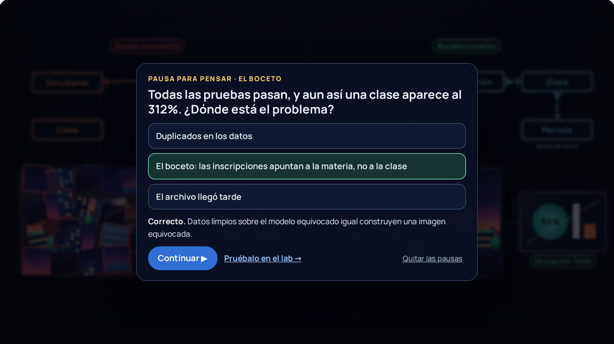
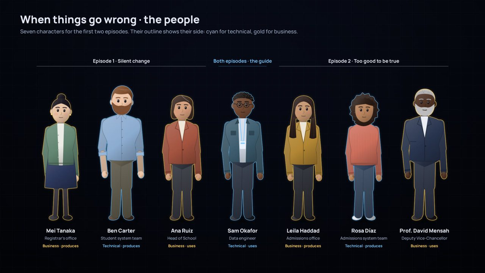
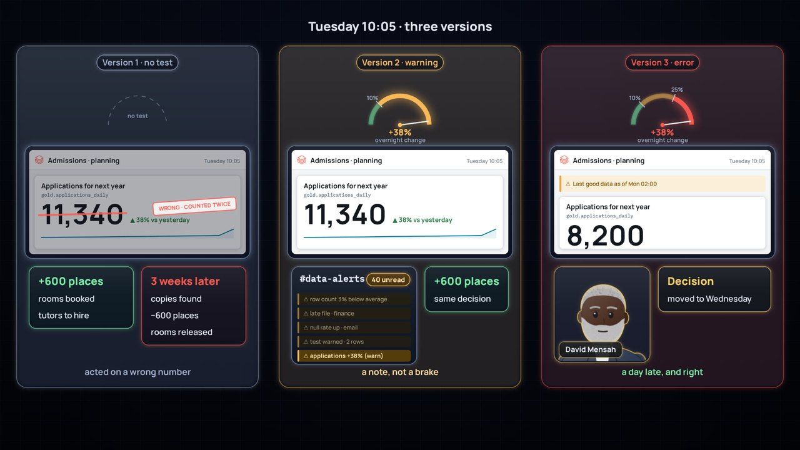

# Cómo se hizo Learning Data

*Un viaje de aprendizaje: lo que exploramos, discutimos, hicimos mal y aprendimos al crear películas cortas sobre plataformas de datos.*

Todo empezó con una película. *La vida interior de los datos* se hizo en dos días, el 25 y el 26 de septiembre de 2026, en una sola conversación de trabajo larga entre el autor y Claude, un modelo de IA creado por Anthropic. El autor aportó el encargo, el conocimiento de la plataforma y la mayoría de las objeciones. Claude propuso opciones, verificó datos, escribió el código y renderizó cada cuadro. Las secciones 1 a 10 cuentan esa historia, desde la primera pregunta hasta el sitio publicado.

Después, los comentarios convirtieron una película en cuatro: *A Sharper Sketch*, sobre modelado de datos, y una serie, *Cuando algo sale mal*, con *Cambio silencioso* y *Demasiado bueno para ser verdad*. La sección 11 cuenta qué cambió al hacer más de una, y las lecciones del final cubren las cuatro.

**En esta página**

[TOC]

## De un vistazo

| Etapa | Qué pasó | Qué produjo |
|---|---|---|
| 1. El encargo | Explicar una plataforma de datos con Databricks y dbt para que un adolescente la entienda y un ingeniero de datos esté de acuerdo | Una lista de componentes que la película debía mostrar |
| 2. La analogía | Se pusieron a prueba ríos, bibliotecas, cyberpunk, tuberías industriales y el cuerpo humano | Un recorrido documental donde los datos viajan como luz |
| 3. Los hechos | Cada afirmación sobre un producto se verificó con fuentes actuales | Una hoja de rigor, y varios productos con nombre nuevo |
| 4. El estilo | Cuatro tableros de estilo, y luego "no hay una luz mejor que otra" | Luz que lleva imágenes, dos zooms, pinturas para cada público |
| 5. El mapa de metáforas | Imprimir, escanear, proyectores, un boceto, un cerebro | Un mundo coherente |
| 6. El primer corte | Una película muda de 4:56, hecha por completo con código | Revisión y correcciones cuadro por cuadro |
| 7. La gran revisión | Sistema de registro, estilo, dbt, el boceto, logotipos, exposures | Un nuevo lenguaje de diseño |
| 8. Puntos de control | Cinco cuadros de estilo, un boceto de sonido, cuatro pruebas de voz | Acuerdo antes de reconstruir |
| 9. El segundo corte | 6:17 con narración, música y sonido, sincronizados con la voz | Productos de datos variados, un cerebro, actualizaciones en vivo |
| 10. La publicación | Un sitio que dibuja la película en vivo, videos renderizados con el mismo código, y esta historia | El sitio, este repositorio y sus releases |
| 11. Más películas | Un comentario se volvió película, las películas se volvieron serie, y cada revisión se volvió una verificación | *A Sharper Sketch*, *Cambio silencioso*, *Demasiado bueno para ser verdad*, y un sitio organizado por temas |

## 1. El encargo

El primer mensaje pedía tres cosas:

- **Qué mostrar:** eventos con Zerobus Ingest, archivos con Auto Loader, transformación con dbt, significado y modelado, trabajo transaccional y analítico lado a lado, y todas las formas en que los datos salen de la plataforma: eventos, SQL endpoints, plataformas de integración y uso compartido sin copias (sharing, mirroring, federación). Además, Databricks Apps, Genie Agents y Genie Ontology.
- **Para quién:** "que cualquiera lo entienda, incluso un adolescente", sin perder el rigor de la ingeniería de datos.
- **Una restricción:** inspirada en la plataforma real de una universidad, pero sin nombrarla nunca, para poder compartirla.

Un segundo mensaje ubicó la historia en la educación superior, para que otras universidades pudieran usarla, y pidió mostrar cómo la plataforma llega al conocimiento más amplio de la organización (páginas de la intranet, portales, definiciones y procesos) a través de MCP.

## 2. Encontrar la analogía

La primera pregunta fue la analogía: ¿ríos, bibliotecas, cyberpunk, tuberías industriales o el cuerpo humano? Cada una se puso a prueba con la idea más difícil de la película: compartir sin copias.

- **Ríos:** conocidos, pero el agua no puede estar en dos lugares a la vez, así que enseñan mal el zero-copy.
- **Bibliotecas:** buenas para catálogos y definiciones, pero estáticas. Sin eventos, sin flujo.
- **Cyberpunk:** una estética, no una analogía, y transmite vigilancia y caos, lo contrario de los datos gobernados.
- **Tuberías industriales:** buenas para el refinado, pero frías, y las tuberías sugieren copiar.
- **Cuerpo humano:** el mejor estilo de cámara, pero asignar órganos a herramientas se vuelve forzado.

La respuesta fue ninguna: un recorrido documental por la plataforma real, al estilo de *The Inner Life of the Cell* y *Powers of Ten*, con los datos viajando como luz. La idea clave fue que toda analogía física se rompe con el zero-copy, así que esa ruptura se convirtió en el giro dramático de la película.

> **Lección:** pon a prueba una analogía con el mecanismo más difícil de explicar, no con el más fácil.

## 3. Verificar los hechos

Antes de cualquier animación, cada afirmación sobre un producto se verificó con fuentes actuales. Varias cosas habían cambiado ese año:

- Delta Sharing había cambiado de nombre a **OpenSharing**, dbt Cloud se había convertido en la **dbt platform**, y dbt Explorer ahora es **Catalog**.
- **Genie Ontology** y **Lakehouse Sync** de Lakebase (los cambios que regresan a Delta) estaban en Public Preview, así que la película los presenta como nuevos.
- **Las tablas sincronizadas de Lakebase son una copia administrada**, no zero-copy, y el guion lo dice.
- **El mirroring de Azure Databricks en Fabric** replica los metadatos y lee los datos mediante accesos directos (shortcuts), sin copiarlos. El mirroring de otras fuentes sí copia.

Todo lo que la película simplifica está escrito en una **hoja de rigor** dentro del [guion](https://github.com/roanboc/learning-data/blob/main/films/inner-life-of-data/script.md) (en inglés): qué muestra cada escena, la tecnología real y lo que agregaría un experto.

> **Lección:** los nombres y la madurez de los productos cambian rápido. Verifícalos al publicar, y di "preview" cuando algo esté en preview.

## 4. De la luz a las imágenes

Primero vinieron cuatro tableros de estilo: luz viva, una fábrica de vidrio, un plano técnico y un campus en miniatura.

Luego llegó la objeción que cambió la película: "la luz no tiene realmente un proceso de refinado, no hay una luz mejor que otra", y "ninguna de estas opciones muestra la idea de datos distintos, con formas de servicio distintas, para públicos distintos". Un primer intento agregó un banco de filtros y lentes para refinar la luz, pero seguía sin mostrar datos distintos para públicos distintos.

El avance vino de las ideas del autor, unos intercambios después:

- **Datos como paquetes, no como puntos:** imágenes fragmentadas que se vuelven más nítidas y completas a medida que se refinan.
- **Acercar y alejar la cámara,** como en *The Inner Life of the Cell*: la luz que se mueve por la plataforma en la toma abierta, y las imágenes que lleva en el primer plano. Física y arte juntos.
- **Pinturas al final:** el tema es el dominio de negocio, y el estilo depende de para quién es.

Claude validó la idea con un cambio. La primera versión ligaba los estilos a los canales de entrega, por ejemplo el Renacimiento a los SQL endpoints. Un canal es cómo te llega una imagen, no cómo se pinta, y a los expertos esa relación les parecería arbitraria. Así que el estilo pasó a ser **la necesidad del público**: el realismo les da a los analistas cada detalle, un estilo moderno les da a los directivos lo esencial, las reglas estrictas producen los reportes al gobierno, como los conteos a la fecha de corte, y una impresión en vivo sirve a las operaciones. Claude también señaló que el mundo del arte ya habla el idioma del gobierno de datos: catálogo, procedencia, restauración, autenticación y curadores.

Los límites que se acordaron en esta etapa: como máximo tres zooms, solo pinturas originales, y ningún estilo de pintura con puntos, que en Australia puede leerse como pintura aborigen de puntos, protegida por protocolos culturales.

> **Lección:** dale a cada capa de una metáfora una sola tarea. Aquí, la luz explica el movimiento y las imágenes explican el significado.

## 5. El mapa de metáforas

Casi todo el mundo de la película se construyó haciéndole una pregunta a cada objeto: ¿qué significa esto en la plataforma? Los aportes del autor fueron muchas veces los mejores: imprimir una imagen como escribir datos, escanearla como leerlos, y proyectores para el zero-copy. Después llegaron el boceto y el cerebro.

| En la película | En la plataforma |
|---|---|
| Un toque escrito en el sistema académico | Una escritura en el sistema de registro, antes de que la plataforma la vea |
| Un color de luz por cada sistema de origen | Dominios de aplicación (datos alineados a la fuente) |
| El centro de la plataforma de integración | Enrutamiento de mensajes, reintentos y seguridad |
| El carril de Zerobus Ingest | Eventos transmitidos a tablas Delta en segundos |
| La zona de aterrizaje y Auto Loader | Archivos en almacenamiento en la nube, cada uno cargado exactamente una vez |
| Bóvedas de vidrio: bronce, plata, oro | Tablas Delta en cada capa medallion |
| Mosaicos con fallas, duplicados y a destiempo | Problemas reales de los datos en bruto |
| El boceto | El modelo conceptual: entidades y relaciones |
| Módulos de dbt con marcas de verificación | Modelos de fuentes, staging e intermedios, con pruebas |
| El SQL warehouse debajo | El cómputo de Databricks que ejecuta el SQL que compila dbt |
| Un prisma hacia los colores de los dominios de negocio | De datos alineados a la fuente a datos alineados al dominio |
| Pinturas y sus placas | Productos de datos (marts con contratos) y exposures de dbt |
| El panel de Catalog | dbt Catalog: definiciones, fuentes, linaje, exposures |
| El panel de Unity Catalog | Certificación, control de acceso y enmascaramiento |
| El cerebro de la organización | Genie Ontology |
| Un fichero de escritorio | Lakebase, una copia rápida para las apps |
| Una campana, una sala de lectura, copias, un proyector | Eventos, SQL endpoints, copias de integración, compartir sin copias |

## 6. El primer corte

El primer corte se hizo por completo con código: un motor de animación en canvas, una función por escena y una cámara que se desplaza y hace zoom por un solo mundo. Cada cuadro es una función pura del tiempo, así que la película se podía renderizar cuadro por cuadro en un navegador sin interfaz y revisarse como software.

El ciclo de revisión era simple: renderizar cuadros en los momentos en que la narración menciona algo, mirarlos, corregir, repetir. Así se detectaron una refinería saturada, etiquetas que chocaban con los subtítulos, una cámara que nunca se quedaba quieta frente a una pintura, archivos que parecían libreros y un render que se detenía al terminar una sesión (resuelto renderizando en bloques reanudables). El primer corte duraba 4:56, sin sonido, con subtítulos.

## 7. La gran revisión

La revisión que hizo el autor del primer corte fue el punto de quiebre. Cada punto hizo la película más precisa o más coherente:

- **Empezar en el sistema de registro.** En el primer corte, el teléfono escribía directo en la plataforma. En la realidad, el sistema académico guarda primero la inscripción, y después la plataforma la recibe.
- **Un solo lenguaje de diseño.** Los dibujos anticuados junto a lentes cristalinos se veían mezclados. Todo pasó a vidrio oscuro, bordes luminosos, íconos de línea fina y una sola tipografía, incluidos los marcos de las pinturas.
- **Hacer visible a dbt, y mostrar las capas juntas.** El linaje se perdía entre los pasos. Una nueva vista general muestra bronce, plata y oro sobre el Databricks Lakehouse, con el grafo de linaje de dbt arriba.
- **Mostrar de quién es cada componente,** con los logotipos oficiales de Databricks y dbt, sin alterar.
- **El boceto va primero.** El modelo conceptual es el boceto en bruto del mundo, y sin él la imagen nunca tiene sentido. Ahora la película también muestra el boceto equivocado: nada encaja, y una cifra más adelante marca 312%.
- **Pinturas como productos de datos.** Claude agregó una precisión aquí. En dbt, un **exposure** declara un uso posterior, como un dashboard, un reporte o una app. El producto de datos en sí es un mart con un contrato y un responsable. Así que la pintura se convirtió en el producto de datos, y su placa en el exposure.
- **De dominios de aplicación a dominios de negocio,** eventos a través de una plataforma de integración, y mosaicos que se ven digitales y no de papel. En palabras del autor, los anteriores parecían "más bien servilletas".

> **Lección:** una imagen puede ser hermosa y aun así estar equivocada. La pregunta detrás de cada punto de la revisión era "¿así es como funciona de verdad?"

## 8. Puntos de control antes de reconstruir

Reconstruir todo era costoso, así que el nuevo estilo se acordó primero con cinco **cuadros de estilo**.

Los cuadros generaron una ronda más de objeciones. Dos compuertas decían "staging models", lo cual confundía, y las pruebas aparecían como un solo paso cuando en la práctica corren en todas partes. La solución fue un módulo por cada capa de dbt (fuentes, staging, intermedios), cada uno con sus propias pruebas, y dos fallas detenidas exactamente donde se detectarían en la realidad.

El audio pasó por los mismos puntos de control. El primer corte no tenía sonido porque Claude había dicho que no podía producir una voz, y el autor lo cuestionó. La música y los efectos de sonido se podían sintetizar con código, y un modelo de voz de código abierto ([Kokoro](https://huggingface.co/hexgrad/Kokoro-82M), Apache 2.0) podía correr sin conexión. Siguieron un boceto de sonido de 40 segundos y cuatro pruebas de voz de cinco segundos, y se eligió la voz femenina estadounidense.

> **Lección:** los puntos de control baratos, como un cuadro fijo o un clip de cinco segundos, ahorran reconstrucciones costosas.

## 9. El segundo corte

La película reconstruida está sincronizada con su narración. Cada una de sus 82 líneas se grabó por separado, y cada escena coloca su animación en el momento en que se dice su línea. La música baja bajo la voz, unos 60 efectos de sonido caen en momentos clave de la historia, y la mezcla está normalizada para la web.

La última ronda de comentarios fue sobre riqueza y honestidad:

- **Variedad, no copias.** Cada dominio ahora muestra seis productos de datos distintos y con nombre, en lugar de recortes repetidos de una misma pintura.
- **El consumo es parte de la plataforma.** Databricks Apps, Genie, y los dashboards y SQL se sumaron a la vista de extremo a extremo.
- **Un cerebro de la organización.** Genie Ontology se convirtió en una red neuronal con forma de cerebro, con las entidades del boceto como centros.
- **Lo que está en vivo debe verse en vivo.** Los productos de datos en vivo ahora se actualizan, con luces que se encienden y se apagan.
- **Las pausas intencionales deben verse intencionales.** Una pausa dramática que se desvanecía casi a negro parecía una falla, así que se convirtió en una pausa luminosa de un segundo con el proyector encendiéndose.

## 10. Una película, dos formas de verla

En el sitio, la película no es un video. Cuando presionas Reproducir, tu navegador descarga el código de la película (unos 240 KB) y su banda sonora (unos 7 MB). Luego dibuja la película él mismo, en un canvas, cada vez que se actualiza la pantalla: normalmente 60 veces por segundo. Ningún servidor ejecuta nada. GitHub Pages solo entrega los archivos, y tu propio dispositivo hace el dibujo.

Esto funciona porque cada cuadro es una función del tiempo. Dale al código un momento, como 2:31, y sabe dónde está la cámara, qué mosaicos brillan y qué subtítulo se ve. La banda sonora es el reloj: en cada actualización, el código le pregunta al audio cuánto lleva reproducido y dibuja ese momento, así que imagen y sonido no pueden desfasarse.

Dibujar en vivo le da al sitio cosas que un archivo de video no puede:

- **Es liviano.** Unos 7 MB en lugar de 173 MB, así que empieza de inmediato, incluso con una conexión lenta.
- **Se ve nítido en cualquier tamaño.** Cada cuadro se dibuja para tu pantalla, desde un teléfono hasta un monitor 4K.
- **Puede responder.** Los capítulos saltan directo a una escena. *Pausa para pensar* se detiene en el último cuadro de un capítulo y hace una pregunta. Los labs dibujan con los mismos componentes y reproducen un capítulo a la vez. Los subtítulos se activan y se desactivan.
- **Una corrección llega a todas partes.** Si un producto cambia de nombre, el reproductor, los labs y las situaciones cambian juntos.

Entonces, ¿para qué hacer un archivo de video? El mismo código también renderiza un MP4. Un navegador sin ventana dibuja cada cuadro en 1080p, unos 15,500, y ffmpeg los une con la banda sonora. El archivo sigue siendo importante:

- **Las plataformas aceptan archivos, no páginas web.** LinkedIn, YouTube, Teams, la plataforma de aprendizaje de una universidad y las apps de mensajería piden un archivo de video.
- **Se reproduce en cualquier lugar, incluso sin conexión.** En un aula con mal Wi-Fi, en una presentación, en un avión o en un televisor.
- **Se ve igual para todos.** La película en vivo depende del navegador y del dispositivo de quien la mira: un teléfono antiguo puede saltarse cuadros, y un navegador que no probamos puede dibujar distinto. Un video es fijo, cuadro por cuadro.
- **Guarda cada versión.** El sitio siempre muestra la película más reciente; cada release guarda el video tal como se publicó.
- **Es fácil de citar.** Cualquiera puede pausar en un cuadro, recortar un clip o poner un momento en una presentación.

Renderizar también es la prueba más estricta de la película. El sitio solo dibuja los momentos que alguien mira; un render los dibuja todos. Una vez, un render se detuvo a mitad de camino porque un momento de la película no se podía dibujar. En el sitio, ese momento habría congelado el reproductor de quien llegara a él. Ahora, una revisión rápida dibuja cada décima de segundo antes de cada render.

Los videos se publican con un workflow de GitHub. Renderiza los dos idiomas a partir del código del repositorio, en las máquinas de GitHub, y se detiene antes si el reproductor del sitio no está construido con ese mismo código. Lo que la gente descarga es lo que el sitio reproduce.

> **Lección:** dibuja en vivo para aprender, y renderiza un archivo para compartir. Construye ambos desde una sola fuente, para que nunca se contradigan.

## 11. De una película a cuatro

### Un comentario se volvió la siguiente película

Los comentarios sobre *La vida interior de los datos* señalaron que su boceto (estudiante, clase, inscripción, periodo, carrera) era una simplificación excesiva. Podíamos corregir el boceto en silencio, o dejar que una película nueva lo dijera. Elegimos lo segundo. *A Sharper Sketch* empieza llamando al boceto por lo que era, y luego lo hace más preciso, una pregunta a la vez, cada vez que una pregunta admite más de una respuesta. Un sello de versión lleva el boceto de v1 a v2, y la última toma sugiere una v3: los modelos cambian, no a menudo, pero siempre.

- **Cada película, un solo tema.** Los primeros borradores se desviaban hacia cómo dbt construye las tablas físicas. Ese detalle quedó guardado para una película futura para ingenieros, y esta se queda en lo que el modelo significa.
- **Elige un modelo de referencia a conciencia.** La película compara el boceto con TCSI porque es público, y dice que muchas universidades usan en realidad MortarCAPS. Suele haber más de un estándar: elige uno y di por qué; luego adóptalo donde encaja, extiéndelo donde no, y registra cada diferencia.

### Una serie, con personas en pantalla

*La vida interior de los datos* sigue los datos cuando todo sale bien. La siguiente idea fue mostrar qué pasa cuando no, y creció hasta ser una serie, *Cuando algo sale mal*, con un solo lema: «Falla de forma segura. Corrige una vez». Cada película toma una forma en que algo sale mal, empieza por la persona a quien le llega, sigue el linaje río arriba hasta la causa, y vuelve con la solución. Una lista de candidatas (un archivo que llega tarde, una tabla sobrescrita, una promesa rota, miradas indebidas sobre datos personales) mantiene cada película en un solo mecanismo.

- **Un cuadrado de cuatro personas.** Todo cambio tiene un lado técnico y uno de negocio, y un lado que produce los datos y otro que los usa. Cada película pone a una persona en cada esquina, y Sam, el ingeniero de datos, guía todas las películas. El color del contorno de cada persona muestra su lado: cian para el técnico, dorado para el de negocio.
- **Prueba los personajes en código antes de escribir un guion.** Una hoja de personajes dibujó siete personas en tres poses y tres expresiones. Mostró que las caras funcionan con este nivel de sencillez, y lo que todavía no: solo vistas de frente, nadie sentado, manos simples. Los guiones se escribieron dentro de esos límites.
- **Sin culpables, y creíble.** No hay villanos: una buena idea, una actualización bien hecha y una sincronización que falló por tiempo de espera, como pasa. Las cifras son pequeñas y plausibles: una clase al 108% en lugar de al 96% es justo el tipo de cifra equivocada que nadie cuestiona.
- **Muestra las alternativas lado a lado.** *Demasiado bueno para ser verdad* muestra el mismo martes de tres maneras: sin prueba, con una advertencia y con un error. Lo único que cambia entre las tres es el indicador, y esa es la lección.

### Puntos de control más pequeños, y antes

Las películas siguientes sumaron puntos de control que cuestan menos que un render: un tratamiento con las decisiones que el autor debe tomar, un esquema de la historia escrito fragmento a fragmento, la hoja de personajes, cuadros de estilo dibujados con los propios componentes de la película, y un guion con hoja de rigor e informe de ritmo. Cada decisión quedó por escrito con su fecha, para que la siguiente sesión partiera de ella en lugar de discutirla otra vez.

### Revisiones que midieron el ritmo

Una revisión del corte con respiraciones de *La vida interior de los datos* encontró que la duración era correcta y el ritmo no. Los promedios parecían sanos, 115 palabras por minuto, pero la voz seguía apurada, a 171 palabras por minuto, entre 32 paradas largas, y la música subía 7,5 dB en un cuarto de segundo en cada parada. También encontró un error presente desde el principio: el capítulo inicial no tenía música. La corrección marcó el ritmo de todas las películas siguientes: una pausa natural de unos 0,8 s después de cada oración, pausas más largas solo donde una idea necesita asentarse, muy pocos momentos sin palabras, y música que sube despacio. Cada película tuvo además su propia música.

La voz recibió el mismo trato. Subir el tono de la voz en español la hizo sonar robótica: un modelo de naturalidad le dio 3,24 sobre 5. Mezclarla con la voz del narrador en inglés subió la nota a 4,33, e hizo que los dos idiomas sonaran como un mismo narrador.

### Que se parezca a lo que la gente conoce

En *Cambio silencioso*, la pintura moderna que representaba un producto de datos se leía como un gráfico de torta tachado. Se convirtió en un dashboard al estilo de Databricks, con una tarjeta de KPI y una nota ámbar que dice qué tan viejos son los datos. Quien mira reconoce un dashboard al instante, y la historia puede dedicar su tiempo al problema. Una revisión cuadro por cuadro de la misma película encontró 72 problemas, desde cajas cortadas en el borde del cuadro hasta texto debajo de los subtítulos; 71 se corrigieron antes de publicarla.

### Películas independientes, y un sitio organizado por temas

Con cuatro películas, numerarlas sugeriría un orden que no existe. Por eso las películas no llevan número: cada una empieza con un resumen de una línea, y el sitio cuelga cada tema del capítulo de *La vida interior de los datos* que profundiza. Todas las películas tienen los mismos tres pasos (Mira, Desarma y Tú decides), y el progreso se guarda por película. Cada problema que una revisión encontró en el sitio, como poco contraste, el foco del teclado perdido o un panel que tapaba los controles del reproductor, se volvió una verificación automática, para que no vuelva.

> **Lección:** hacer más de una película es lo que convierte un proceso en un método. Escribe lo que funcionó, convierte cada revisión en una verificación, y deja que la siguiente película parta de ambas.

## 12. Lo que salió mal en el camino

Los errores fueron parte del proceso, y casi todos enseñaron algo:

- Al principio, Claude descartó el audio demasiado rápido. La solución fue un modelo de voz sin conexión y sonido sintetizado.
- Se dijo que unos clips de voz estaban adjuntos cuando no lo estaban, y el autor tuvo que preguntar dónde estaban.
- Los renders en segundo plano se detenían al terminar una sesión, y un trabajo de voz se quedó sin memoria junto al renderizador. Ambos se volvieron trabajos reanudables, ejecutados de uno en uno.
- Un diagrama de relaciones se dibujó primero con las patas de gallo al revés.
- Las etiquetas chocaban con los subtítulos hasta que cada escena se revisó contra el área de subtítulos.
- La primera corrección del ritmo confió en los promedios. Una película puede cumplir todos los promedios y aun así sonar como «apuro, parada, apuro, parada».
- El capítulo inicial no tuvo música desde la primera versión, y nadie lo notó hasta que una revisión midió el sonido.
- El hilo rojo que sigue el linaje en *Cambio silencioso* cruzaba al principio el dashboard y la plataforma, y resultaba recargado. Ahora avanza un paso del linaje a la vez.
- Una voz con el tono subido sonaba robótica, y una pintura abstracta se leía como un gráfico tachado. Ambas se reemplazaron por algo conocido: una voz mezclada, y un dashboard realista.

## Lecciones aprendidas

1. **Pon a prueba las analogías con el mecanismo más difícil.** El zero-copy descartó los ríos y las tuberías.
2. **Dale a cada capa de una metáfora una sola tarea.** La luz se mueve; las imágenes llevan el significado.
3. **Asigna cada objeto a un mecanismo,** y lleva una hoja de rigor con lo que la imagen simplifica.
4. **Muestra el refinado en un solo registro.** El mismo fragmento está en bruto en bronce, limpio en plata y adaptado a un público en oro.
5. **Empieza donde nacen los datos,** en el sistema de registro.
6. **Muestra el modelo conceptual, y muéstralo fallando.** El boceto equivocado enseña más que el correcto.
7. **Mantén claros los roles.** dbt escribe y prueba las recetas; Databricks ejecuta, guarda y gobierna.
8. **Verifica nombres y madurez al publicar.** Los productos cambian de nombre, y lo que está en preview no tiene disponibilidad general.
9. **La coherencia le gana al adorno.** Usa un solo lenguaje de diseño, y varía el contenido en lugar de repetirlo.
10. **Usa puntos de control baratos.** Los cuadros de estilo y las pruebas de voz de cinco segundos van antes de las reconstrucciones completas.
11. **Crea contenido multimedia como código.** Cuando las escenas están sincronizadas con la narración, cambiar una línea vuelve a sincronizar toda la película.
12. **Valida mirando y midiendo,** y di claramente lo que no puedes verificar. Claude no podía escuchar el audio, así que el autor juzgó el balance.
13. **Las objeciones son el motor.** Casi todas las mejoras empezaron con "eso no es del todo correcto".
14. **Dibuja en vivo para aprender, y renderiza un archivo para compartir,** ambos desde una sola fuente.
15. **Convierte los comentarios en la siguiente pieza.** Decir, en una película nueva, que el boceto era una simplificación excesiva enseñó más que corregirlo en silencio.
16. **Una película, un mecanismo.** Guarda lo que no encaja, y lleva una lista de candidatas para películas futuras.
17. **Pon personas en todos los lados de un problema.** Técnico y de negocio, quien produce y quien usa: un cambio solo es seguro cuando los cuatro pueden verlo.
18. **Muestra las alternativas lado a lado,** para que lo único que cambia sea la lección.
19. **Los promedios esconden el ritmo.** Mide dónde caen las pausas, no solo cuánto silencio hay.
20. **Usa lo que el público ya conoce.** Un dashboard conocido le gana a una imagen abstracta que hay que explicar.
21. **Escribe las decisiones, con su fecha.** La siguiente sesión parte de ellas en lugar de discutirlas otra vez.
22. **Convierte cada hallazgo de una revisión en una verificación,** para que el mismo problema no vuelva.

## Reutilízala

El código fuente y la guía para reconstruir cada película están en este repositorio (en inglés): [*La vida interior de los datos*](https://github.com/roanboc/learning-data/blob/main/films/inner-life-of-data/source/README.md), [*A Sharper Sketch*](https://github.com/roanboc/learning-data/blob/main/films/a-sharper-sketch/README.md) y [la serie *Cuando algo sale mal*](https://github.com/roanboc/learning-data/blob/main/films/when-things-go-wrong/README.md), con sus tratamientos, su hoja de personajes y sus cuadros de estilo. La [guía práctica](https://github.com/roanboc/learning-data/blob/main/PLAYBOOK.md) (en inglés) reúne lo que conviene reutilizar en la próxima película o curso. Para adaptar *La vida interior de los datos* a otra universidad, cambia la narración en `src/narration.js`, o en `src/i18n/es/narration.js` para la versión en español (por ejemplo "clase", "fecha de corte" y los nombres de los dominios), vuelve a generar la voz y renderiza de nuevo.
