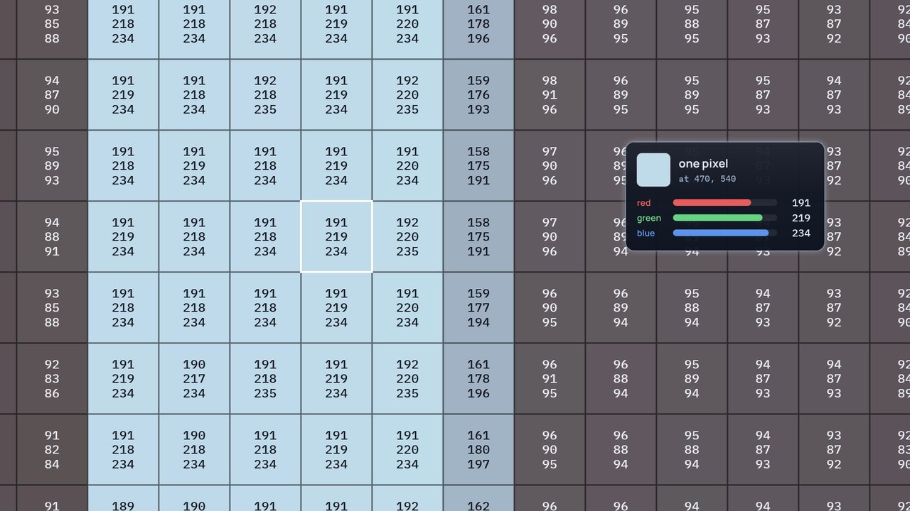
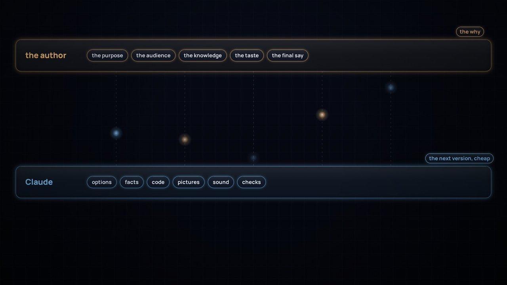
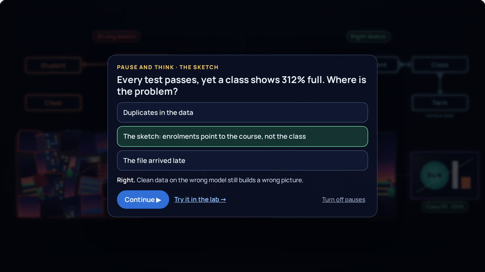

# The making of Learning Data

*A learning journey: what we explored, argued about, got wrong and learned while making short films about data platforms.*

It started with one film. *The Inner Life of Data* was made over two days, 25 and 26 September 2026, in one long working conversation between the author and Claude, an AI model made by Anthropic. The author brought the brief, the platform knowledge and most of the pushback. Claude proposed options, checked facts, wrote the code and rendered every frame. Sections 1 to 10 tell that story, from the first question to the published site.

Then feedback turned one film into four: *A Sharper Sketch*, on data modelling, and a series, *When things go wrong*, with *Silent change* and *Too good to be true*. Section 11 tells what changed when we made more than one, and the lessons at the end cover all four.

Start with two short films: how the films are drawn, and how they are made.

<section class="making-film" id="data-for-films" aria-labelledby="dff-h">
<h2 id="dff-h">Data for Films</h2>

How the films are drawn: one frame of <i>The Inner Life of Data</i>, taken apart from a single pixel and built back up, with shapes, layers, components, a camera and time.

<audio id="dff-snd" preload="metadata" src="../assets/making-of/data-for-films.mp3"></audio>

<button type="button" class="play-badge" data-play>▶ Play the film · 5 min</button>

<canvas id="dff-film" width="1280" height="720" aria-label="Animated film: Data for Films"></canvas>

<button id="dff-play">Play</button><input id="dff-scrub" type="range" min="0" step="0.01" value="0" aria-label="Seek">0:00<button id="dff-cc" class="on" aria-pressed="true">Captions</button><button id="dff-fs">Full screen</button>

<a href="https://github.com/roanboc/learning-data/releases/latest/download/data-for-films.mp4">Download the video</a><a href="https://github.com/roanboc/learning-data/blob/main/films/making-of/1-data-for-films/script.md">Read the script</a>

How to read the film

The film stops <i>The Inner Life of Data</i> at 2:31 and takes that frame apart; every number it shows is read from the real frame. The narration is a synthetic voice.

English captions are on by default; turn them off with Captions. Caption files for other players: <a href="https://github.com/roanboc/learning-data/tree/main/films/making-of/1-data-for-films/captions">en.srt and en.vtt</a>.

</section>
<section class="making-film" id="thats-not-quite-right" aria-labelledby="nqr-h">
<h2 id="nqr-h">That's not quite right</h2>

How the films are made: what the person drives, what Claude does, and why a cheap next version makes room for more pushback.

<audio id="nqr-snd" preload="metadata" src="../assets/making-of/thats-not-quite-right.mp3"></audio>

<button type="button" class="play-badge" data-play>▶ Play the film · 4½ min</button>

<canvas id="nqr-film" width="1280" height="720" aria-label="Animated film: That's not quite right"></canvas>

<button id="nqr-play">Play</button><input id="nqr-scrub" type="range" min="0" step="0.01" value="0" aria-label="Seek">0:00<button id="nqr-cc" class="on" aria-pressed="true">Captions</button><button id="nqr-fs">Full screen</button>

<a href="https://github.com/roanboc/learning-data/releases/latest/download/thats-not-quite-right.mp4">Download the video</a><a href="https://github.com/roanboc/learning-data/blob/main/films/making-of/2-the-process/script.md">Read the script</a>

How to read the film

Warm light is the author; cool light is Claude, an AI model by Anthropic. The pictures from the making of are real; the author's words in quotation marks are theirs, and the other messages are paraphrased. The narration is a synthetic voice.

English captions are on by default; turn them off with Captions. Caption files for other players: <a href="https://github.com/roanboc/learning-data/tree/main/films/making-of/2-the-process/captions">en.srt and en.vtt</a>.

</section>

## At a glance

| Stage | What happened | What it produced |
|---|---|---|
| 1. The brief | Explain a Databricks and dbt data platform so a teenager understands and a data engineer agrees | A list of components the film must show |
| 2. The analogy | Rivers, libraries, cyberpunk, industrial pipes and the human body were tested | A documentary fly-through where data travels as light |
| 3. The facts | Every product claim was checked against current sources | A rigour sheet, and several renamed products |
| 4. The style | Four style boards, then "there is no better light than other" | Light that carries pictures, two zooms, paintings for audiences |
| 5. The metaphor map | Printing, scanning, projectors, a sketch, a brain | One consistent world |
| 6. The first cut | A silent 4:56 film, built entirely in code | Frame-by-frame review and fixes |
| 7. The big review | System of record, style, dbt, the sketch, logos, exposures | A new design language |
| 8. Checkpoints | Five style frames, a sound sketch, four voice tests | Agreement before the rebuild |
| 9. The second cut | 6:17 with narration, music and sound, timed to the voice | Varied data products, a brain, live updates |
| 10. Publishing | A site that draws the film live, videos rendered from the same code, and this story | The site, this repository and its releases |
| 11. More films | Feedback became a film, the films became a series, and every review became a check | *A Sharper Sketch*, *Silent change*, *Too good to be true*, and a site organised by topic |

## 1. The brief

The first message asked for three things:

- **What to show:** events through Zerobus Ingest, files through Auto Loader, transformation with dbt, meaning and modelling, transactional and analytical work side by side, and every way data leaves the platform: events, SQL endpoints, integration platforms and zero-copy sharing (sharing, mirroring, federation). Plus Databricks Apps, Genie Agents and Genie Ontology.
- **Who for:** "anyone can understand, even a teenager", without losing data engineering rigour.
- **One constraint:** inspired by a real university platform, but never naming it, so it can be shared.

A second message set the story in higher education, so other universities could use it, and asked to show the platform reaching the organisation's wider knowledge (intranet pages, portals, definitions and processes) through MCP.

## 2. Finding the analogy

The first question was the analogy: rivers, libraries, cyberpunk, industrial pipes or the human body? Each was tested against the hardest idea in the film, zero-copy sharing.

- **Rivers:** familiar, but water can't be in two places at once, so it teaches zero-copy wrongly.
- **Libraries:** good for catalogues and definitions, but static. No events, no flow.
- **Cyberpunk:** a look, not an analogy, and it signals surveillance and chaos, the opposite of governed data.
- **Industrial pipes:** good for refining, but cold, and pipes suggest copying.
- **Human body:** the best camera style, but mapping organs to tools gets forced.

The answer was none of them: a documentary fly-through of the real platform, in the spirit of *The Inner Life of the Cell* and *Powers of Ten*, with data travelling as light. The key insight was that every physical analogy breaks at zero-copy, so that break became the film's dramatic twist.

> **Lesson:** test an analogy against the mechanism that is hardest to explain, not the easiest one.

## 3. Getting the facts right

Before any animation, every product claim was checked against current sources. Several things had changed that year:

- Delta Sharing had been renamed **OpenSharing**, dbt Cloud had become the **dbt platform**, and dbt Explorer is now **Catalog**.
- **Genie Ontology** and Lakebase's **Lakehouse Sync** (changes flowing back to Delta) were in Public Preview, so the film presents them as new.
- **Lakebase synced tables are a managed copy**, not zero-copy, and the script says so.
- **Fabric mirroring of Azure Databricks** mirrors metadata and reads data through shortcuts, without a copy. Mirroring other sources does copy.

Everything the film simplifies is written down in a **rigour sheet** in the [script](https://github.com/roanboc/learning-data/blob/main/films/inner-life-of-data/script.md): what each scene shows, the real technology, and what an expert would add.

> **Lesson:** names and maturity change fast. Check them when you publish, and say "preview" when something is in preview.

## 4. From light to pictures

Four style boards came first: living light, a glass factory, a blueprint and a miniature campus.

The pushback that changed the film came next: "the light doesn't really have a refinement process, like there is no better light than other", and "none of these options show the idea of different data with different service methods for different audiences". A first attempt added a bench of filters and lenses to refine the light, but it still didn't show different data for different audiences.

The breakthrough came from the author's ideas, a few exchanges later:

- **Data as packages, not dots:** fragmented pictures that become sharper and more complete as they're refined.
- **Zooming in and out,** like *The Inner Life of the Cell*: light moving through the platform in the wide shot, and the pictures it carries in the close-up. Physics and art together.
- **Paintings at the end:** the subject is the business domain, and the style depends on who it's for.

Claude validated the idea with one change. The first version tied styles to delivery channels, for example Renaissance for SQL endpoints. A channel is how a picture reaches you, not how it's painted, and experts would find the link arbitrary. So style became the **audience's need**: realism gives analysts every detail, a modern style gives executives the essence, strict rules produce government reports such as census-date counts, and a live impression serves operations. Claude also pointed out that the art world already speaks the language of data governance: catalogue, provenance, restoration, authentication and curators.

The guardrails agreed at this stage: at most three zooms, original paintings only, and no dot-based painting styles, which in Australia can read as Aboriginal dot painting and are protected by cultural protocols.

> **Lesson:** give each layer of a metaphor one job. Here, light explains movement and pictures explain meaning.

## 5. The metaphor map

Most of the world was built by asking one question of every object: what does this mean in the platform? The author's additions were often the best: printing a picture as writing data, scanning it as reading, and projectors for zero-copy. Later came the sketch and the brain.

| In the film | In the platform |
|---|---|
| A tap written into the student system | A write to the system of record, before the platform sees it |
| A colour of light per source system | Application domains (source-aligned data) |
| The integration platform hub | Message routing, retries and security |
| The Zerobus Ingest lane | Events streamed into Delta tables in seconds |
| The landing zone and Auto Loader | Files in cloud storage, each loaded exactly once |
| Glass vaults: bronze, silver, gold | Delta tables in each medallion layer |
| Glitched, duplicated, mistimed tiles | Real raw-data problems |
| The sketch | The conceptual model: entities and relationships |
| dbt housings with check marks | Sources, staging and intermediate models, with tests |
| The SQL warehouse underneath | Databricks compute running the SQL that dbt compiles |
| A prism into business-domain colours | From source-aligned to domain-aligned data |
| Paintings and their plaques | Data products (marts with contracts) and dbt exposures |
| The Catalog panel | dbt Catalog: definitions, sources, lineage, exposures |
| The Unity Catalog panel | Certification, access control and masking |
| The organisational brain | Genie Ontology |
| A desk card index | Lakebase, a fast copy for apps |
| A bell, a reading room, copies, a projector | Events, SQL endpoints, integration copies, zero-copy sharing |

## 6. The first cut

The first cut was built entirely in code: a canvas animation engine, one function per scene, and a camera that pans and zooms through a single world. Every frame is a pure function of time, so the film could be rendered frame by frame in a headless browser and checked like software.

The review loop was simple: render frames at the moments the narration mentions something, look at them, fix, repeat. It caught a crowded refinery, labels colliding with captions, a camera that never held still on a painting, archives that looked like bookshelves, and a render that stopped when a session ended (solved by rendering in resumable chunks). The first cut ran 4:56, silent, with captions.

## 7. The big review

The author's review of the first cut was the turning point. Each point made the film more accurate or more coherent:

- **Start at the system of record.** The first cut had the phone writing straight into the platform. In reality the student system stores the enrolment first, and the platform takes it in afterwards.
- **One design language.** Old-fashioned drawings next to crystal-clear lenses looked mixed. Everything moved to dark glass, luminous edges, thin line icons and one font, including the painting frames.
- **Make dbt visible, and show the layers together.** The lineage got lost between the steps. A new overview shows bronze, silver and gold on the Databricks Lakehouse, with the dbt lineage graph above.
- **Show whose component is whose,** with the official Databricks and dbt logos, unaltered.
- **The sketch comes first.** The conceptual model is the raw sketch of the world, and without it the picture never makes sense. The film now shows the wrong sketch too: nothing fits, and a downstream number reads 312%.
- **Paintings as data products.** Claude added a precision here. In dbt, an **exposure** declares a downstream use, such as a dashboard, report or app. The data product itself is a mart with a contract and an owner. So the painting became the data product, and its plaque the exposure.
- **From application domains to business domains,** events through an integration platform, and tiles that look digital rather than like paper. In the author's words, the old ones looked "more like napkins".

> **Lesson:** a picture can be beautiful and still wrong. The question behind every review point was "is this how it really works?"

## 8. Checkpoints before the rebuild

Rebuilding everything was expensive, so the new look was agreed on five **style frames** first.

The frames drew one more round of pushback. Two gates were both labelled "staging models", which was confusing, and tests appeared as a single step when in practice they run everywhere. The fix was one housing per dbt layer (sources, staging, intermediate), each with its own tests, and two failures stopped exactly where they would really be caught.

Audio went through the same checkpoints. The first cut was silent because Claude had said it couldn't produce a voice, and the author challenged that. Music and sound effects could be synthesised in code, and an open-source voice model ([Kokoro](https://huggingface.co/hexgrad/Kokoro-82M), Apache 2.0) could run offline. A 40-second sound sketch and four five-second voice tests followed, and the American female voice was chosen.

> **Lesson:** cheap checkpoints, like a still frame or a five-second clip, save expensive rebuilds.

## 9. The second cut

The rebuilt film is timed to its narration. Each of its 82 lines is voiced separately, and every scene places its animation on the moment its line is spoken. The music ducks under the voice, about 60 sound effects land on story cues, and the mix is normalised for the web.

The last round of feedback was about richness and honesty:

- **Variety, not copies.** Each domain now shows six different, named data products instead of repeated crops of one painting.
- **Consumption is part of the platform.** Databricks Apps, Genie, and dashboards and SQL joined the end-to-end view.
- **An organisational brain.** Genie Ontology became a neural network shaped like a brain, with the sketch's entities as its hubs.
- **Live should look live.** The live data products now update, with lights switching on and off.
- **Intentional pauses must look intentional.** A dramatic pause that faded to near-black read as a glitch, so it became a bright one-second pause with the projector warming up.

## 10. One film, two ways to play

On the site, the film isn't a video. When you press Play, your browser downloads the film's code (about 230 KB) and its soundtrack (about 7 MB). Then it draws the film itself, on a canvas, each time the screen refreshes: usually 60 times a second. No server runs anything. GitHub Pages only hands out the files, and your own device does the drawing.

This works because every frame is a function of time. Give the code a moment, such as 2:31, and it knows where the camera is, which tiles glow and which caption shows. The soundtrack is the clock: at each refresh, the code asks the audio how far it has played and draws that moment, so picture and sound can't drift apart.

Drawing live gives the site things a video file can't:

- **It's small.** About 7 MB instead of about 200 MB, so it starts at once, even on a slow connection.
- **It's sharp at any size.** Each frame is drawn for your screen, from a phone to a 4K monitor.
- **It can respond.** Chapters jump straight to a scene. *Pause and think* holds the last frame of a chapter and asks one question. The labs draw with the same components and play one chapter at a time. Captions switch on and off.
- **One fix lands everywhere.** Rename a product, and the player, the labs and the scenarios change together.

So why make a video file at all? The same code also renders an MP4. A browser with no window draws every frame at 1080p, about 14,400 of them, and ffmpeg joins them to the soundtrack. The file still matters:

- **Platforms take files, not web pages.** LinkedIn, YouTube, Teams, a university's learning platform and messaging apps all want a video file.
- **It plays anywhere, even offline.** In a lecture hall with poor Wi-Fi, in a slide deck, on a plane or on a TV.
- **It looks the same for everyone.** The live film depends on the viewer's browser and device: an old phone may drop frames, and a browser we haven't tested may draw differently. A video is fixed, frame by frame.
- **It keeps each version.** The site always plays the latest film; each release keeps the video exactly as it was published.
- **It's easy to quote.** Anyone can pause on a frame, cut a clip or put a moment in a presentation.

Rendering is also the film's strictest test. The site only draws the moments someone watches; a render draws every one. A render once stopped halfway because one moment of the film failed to draw. On the site, that moment would have frozen the player for whoever reached it. Now a quick check draws every tenth of a second before each render.

The videos are released by a GitHub workflow. It renders both languages from the committed source on GitHub's machines, and stops early if the site's player isn't built from that same source. What people download is what the site plays.

> **Lesson:** draw it live for learning, and render a file for sharing. Build both from one source, so they never disagree.

## 11. From one film to four

### Feedback became the next film

Feedback on *The Inner Life of Data* said its sketch (student, class, enrolment, term, course) was an oversimplification. We could quietly fix the sketch, or let a new film say so. We chose the second. *A Sharper Sketch* opens by calling the sketch what it was, then sharpens it one question at a time, whenever a question can't be answered in only one way. A version stamp takes the sketch from v1 to v2, and the last shot hints at v3: models change, not often, but always.

- **Keep each film on one topic.** Early drafts drifted into how dbt builds the physical tables. That detail was parked for a later film for engineers, so this one stays on what the model means.
- **Choose a reference model deliberately.** The film checks the sketch against TCSI because it is public, and says that many universities actually use MortarCAPS. There is often more than one standard: pick one and say why, then adopt it where it fits, extend it where it doesn't, and record every difference.

### A series, with people on screen

*The Inner Life of Data* follows data when things go right. The next idea was to show what happens when they don't, and it grew into a series, *When things go wrong*, with one tagline: "Fail safely. Fix once." Each film takes one way things go wrong, starts with the person it reaches, follows the lineage upstream to the cause, and comes back down with the fix. A list of candidates (a late file, an overwritten table, a broken promise, the wrong eyes on personal data) keeps each film to one mechanism.

- **A square of four people.** Every change has a technical side and a business side, and a side that produces the data and a side that uses it. Each film puts one person in each corner, and Sam, the data engineer, guides every film. The colour of a person's outline shows their side: cyan for technical, gold for business.
- **Test the characters in code before writing a script.** A character sheet drew seven people in three poses and three expressions. It showed that faces work at this simple level, and what didn't yet: front views only, no sitting, simple hands. The scripts were written around those limits.
- **Blameless and believable.** No villains: a good idea, a well-built upgrade, and a sync that timed out, as syncs do. The numbers are small and plausible: a class shown at 108% instead of 96% is exactly the kind of wrong number nobody questions.
- **Show the alternatives side by side.** *Too good to be true* plays the same Tuesday three ways: with no test, with a warning and with an error. The only thing that differs between the three is the gauge, and that is the lesson.

### Smaller checkpoints, earlier

The later films added checkpoints that cost less than a render: a treatment that lists the decisions the author must make, a story outline written fragment by fragment, the character sheet, style frames drawn with the film's own components, and a script with a rigour sheet and a pacing report. Each decision was written down with its date, so the next session could start from it instead of arguing it again.

### Reviews that measured rhythm

A review of *The Inner Life of Data*'s breathing cut found the length right and the rhythm wrong. The averages looked healthy, at 115 words a minute, but the voice still rushed at 171 words a minute between 32 long stops, and the music jumped up 7.5 dB in a quarter of a second at every stop. It also found a bug that had been there from the start: no music at all in the opening chapter. The fix set the pace for every later film: a natural beat of about 0.8 s after every sentence, longer pauses only where an idea must land, very few wordless moments, and music that rises slowly. Each film also got its own music.

The voice got the same treatment. Raising the Spanish voice's pitch made it sound robotic: a naturalness model scored it 3.24 out of 5. Blending it with the English narrator's voice raised the score to 4.33, and made the two languages sound like one narrator.

### Make it look like what people know

In *Silent change*, the modern painting that stood for a data product read as a pie chart that had been crossed out. It became a dashboard in the style of a Databricks dashboard, with a KPI card and an amber note that says how old the data is. Viewers recognise a dashboard at once, so the story can spend its time on the problem. A frame-by-frame review of the same film found 72 problems, from boxes cut off at the edge of the frame to text under the captions; 71 were fixed before it was published.

### Films that stand alone, and a site organised by topic

With four films, numbering them would suggest an order that doesn't exist. So the films carry no numbers: each opens with a one-line recap, and the site hangs every topic off the chapter of *The Inner Life of Data* it goes deeper on. Every film has the same three steps (Watch, Take it apart, Make the call), and progress is kept per film. Every problem a review found on the site, such as low contrast, lost keyboard focus or a panel covering the player's controls, became an automated check, so it can't come back.

> **Lesson:** making more than one film is where a process becomes a method. Write down what worked, turn each review into a check, and let the next film start from both.

## 12. What went wrong along the way

Mistakes were part of the process, and most of them taught something:

- Claude dismissed audio too quickly at first. The fix was an offline voice model and synthesised sound.
- Voice clips were described as attached when they weren't, and the author had to ask where they were.
- Background renders stopped when a session ended, and a voice job ran out of memory next to the renderer. Both became resumable jobs, run one at a time.
- A relationship diagram was first drawn with its crow's-foot marks backwards.
- Labels collided with captions until every scene was checked against the caption area.
- The first pacing fix trusted averages. A film can meet every average and still play as "rush, stop, rush, stop".
- The opening chapter had no music from the very first version, and nobody noticed until a review measured the sound.
- The red thread that follows the lineage in *Silent change* first cut across the dashboard and the platform, and was too busy. Now it moves one lineage step at a time.
- A pitch-shifted voice sounded robotic, and an abstract painting read as a crossed-out chart. Both were replaced by something familiar: a blended voice, and a real-looking dashboard.

## Lessons learned

1. **Test analogies against the hardest mechanism.** Zero-copy ruled out rivers and pipes.
2. **Give each layer of a metaphor one job.** Light moves; pictures carry meaning.
3. **Map every object to a mechanism,** and keep a rigour sheet for what the picture simplifies.
4. **Show refinement on one record.** The same fragment is rough in bronze, clean in silver and shaped for an audience in gold.
5. **Start where data is born,** in the system of record.
6. **Show the conceptual model, and show it failing.** The wrong sketch teaches more than the right one.
7. **Keep roles clear.** dbt writes and tests the recipes; Databricks runs, stores and governs.
8. **Check names and maturity when you publish.** Products get renamed, and previews aren't generally available.
9. **Coherence beats flourish.** Use one design language, and vary the content instead of repeating it.
10. **Use cheap checkpoints.** Style frames and five-second voice tests come before full rebuilds.
11. **Build media as code.** When scenes are timed to the narration, changing a line re-times the whole film.
12. **Validate by looking and measuring,** and say plainly what you can't check. Claude couldn't hear the audio, so the author judged the balance.
13. **Pushback is the engine.** Nearly every improvement started with "that's not quite right".
14. **Draw it live for learning, and render a file for sharing,** both from one source.
15. **Turn feedback into the next piece.** Saying, in a new film, that the sketch was an oversimplification taught more than fixing it quietly.
16. **One film, one mechanism.** Park what doesn't fit, and keep a list of candidates for later films.
17. **Put people on every side of a problem.** Technical and business, producing and using: a change is only safe when all four can see it.
18. **Show the alternatives side by side,** so that the one thing that differs is the lesson.
19. **Averages hide rhythm.** Measure where the pauses fall, not just how much silence there is.
20. **Use what the audience already knows.** A familiar dashboard beats an abstract picture that needs explaining.
21. **Write decisions down, with the date.** The next session starts from them instead of arguing them again.
22. **Turn every review finding into a check,** so the same problem can't come back.

## Reuse it

Each film's source and rebuild guide are in this repository: [*The Inner Life of Data*](https://github.com/roanboc/learning-data/blob/main/films/inner-life-of-data/source/README.md), [*A Sharper Sketch*](https://github.com/roanboc/learning-data/blob/main/films/a-sharper-sketch/README.md) and [the series *When things go wrong*](https://github.com/roanboc/learning-data/blob/main/films/when-things-go-wrong/README.md), with its treatments, character sheet and style frames. The [playbook](https://github.com/roanboc/learning-data/blob/main/PLAYBOOK.md) collects what to reuse for the next film or course. To adapt *The Inner Life of Data* for another university, change the narration in `src/narration.js` (for example "class", "census date" and the domain names), regenerate the voice, and render again.

